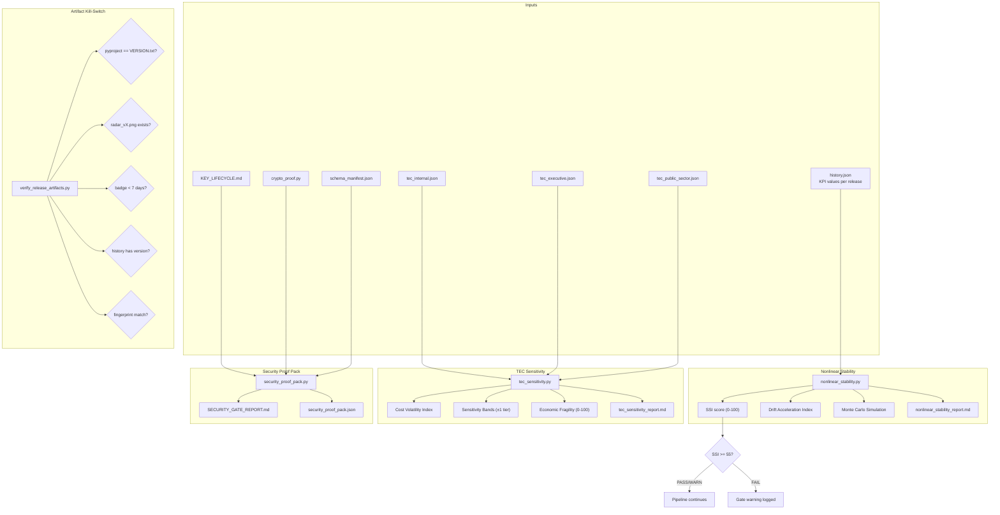

# Stability & Credibility Pipeline

v2.0.7 governance pipeline: nonlinear stability analysis, TEC sensitivity, security proof pack, and artifact kill-switch.

```mermaid
flowchart TD
    subgraph Inputs
        H["history.json<br/>KPI values per release"]
        T1["tec_internal.json"]
        T2["tec_executive.json"]
        T3["tec_public_sector.json"]
        KL["KEY_LIFECYCLE.md"]
        CP["crypto_proof.py"]
        SM["schema_manifest.json"]
    end

    subgraph "Nonlinear Stability"
        H --> NS["nonlinear_stability.py"]
        NS --> SSI["SSI score (0-100)"]
        NS --> DA["Drift Acceleration Index"]
        NS --> MC["Monte Carlo Simulation"]
        NS --> SR["nonlinear_stability_report.md"]
    end

    subgraph "TEC Sensitivity"
        T1 --> TS["tec_sensitivity.py"]
        T2 --> TS
        T3 --> TS
        TS --> CVI["Cost Volatility Index"]
        TS --> SB["Sensitivity Bands (±1 tier)"]
        TS --> EF["Economic Fragility (0-100)"]
        TS --> TSR["tec_sensitivity_report.md"]
    end

    subgraph "Security Proof Pack"
        KL --> SPP["security_proof_pack.py"]
        CP --> SPP
        SM --> SPP
        SPP --> SGR["SECURITY_GATE_REPORT.md"]
        SPP --> SPJ["security_proof_pack.json"]
    end

    subgraph "Artifact Kill-Switch"
        VRA["verify_release_artifacts.py"]
        VRA --> C1{"pyproject == VERSION.txt?"}
        VRA --> C2{"radar_vX.png exists?"}
        VRA --> C3{"badge < 7 days?"}
        VRA --> C4{"history has version?"}
        VRA --> C5{"fingerprint match?"}
    end

    SSI --> GATE{"SSI >= 55?"}
    GATE -->|PASS/WARN| OK["Pipeline continues"]
    GATE -->|FAIL| WARN["Gate warning logged"]
```
