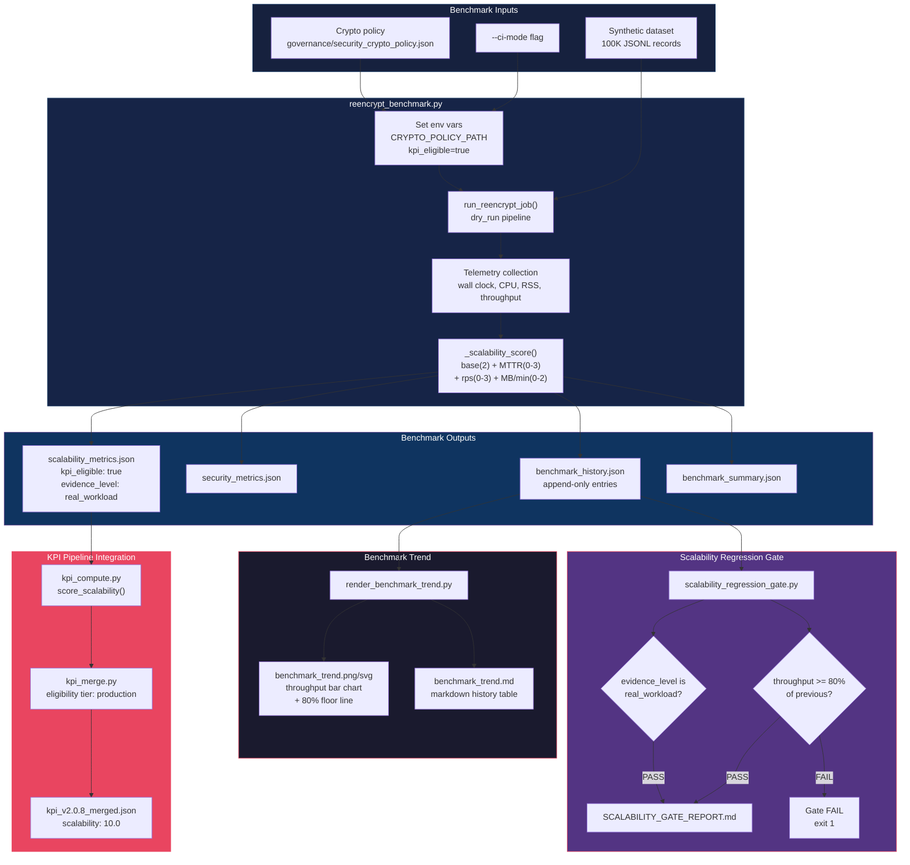

# Scalability Benchmark Pipeline

v2.0.8 CI-eligible benchmark producing scalability evidence, regression gate, and trend visualization.

## Make Targets

| Target | What it does |
| --- | --- |
| `make benchmark` | Run benchmark with `--ci-mode` |
| `make scalability-gate` | Regression gate (80% floor) |
| `make benchmark-trend` | Render trend chart + table |
