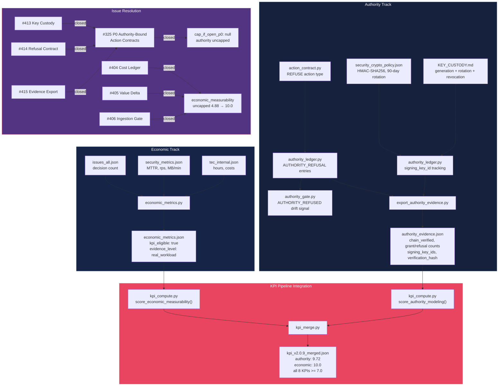

# Authority + Economic Evidence Pipeline

v2.0.9 authority custody, refusal contracts, evidence chain export, and economic metrics uncapping.

## Make Targets

| Target | What it does |
| --- | --- |
| `make authority-evidence` | Export authority evidence chain |
| `make economic-metrics` | Generate economic_metrics.json |
| `make kpi` | Full KPI pipeline (includes both) |
