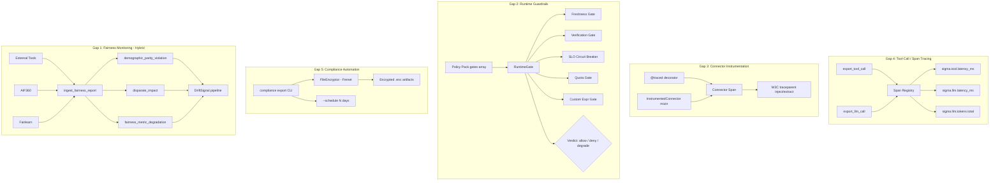

# 23 — Competitive Gap Closure (v2.1.0)

Five infrastructure capabilities closing competitive gaps against Fiddler AI, Arthur AI, Superwise, Langfuse, and LangChain/LangSmith.

```mermaid
graph TB
    subgraph "Gap 4: Tool-Call / Span Tracing"
        TC[export_tool_call] --> SR[Span Registry]
        LC[export_llm_call] --> SR
        SR --> H1[sigma.tool.latency_ms]
        SR --> H2[sigma.llm.latency_ms]
        SR --> H3[sigma.llm.tokens.total]
    end

    subgraph "Gap 3: Connector Instrumentation"
        TD["@traced decorator"] --> CS[Connector Span]
        IM[InstrumentedConnector mixin] --> CS
        CS --> W3C[W3C traceparent inject/extract]
    end

    subgraph "Gap 2: Runtime Guardrails"
        PP[Policy Pack gates array] --> RG[RuntimeGate]
        RG --> FR[Freshness Gate]
        RG --> VR[Verification Gate]
        RG --> SLO[SLO Circuit Breaker]
        RG --> QU[Quota Gate]
        RG --> CX[Custom Expr Gate]
        RG --> VD{Verdict: allow / deny / degrade}
    end

    subgraph "Gap 5: Compliance Automation"
        CE[compliance export CLI] --> ENC[FileEncryptor - Fernet]
        CE --> SCH["--schedule N days"]
        ENC --> ART[Encrypted .enc artifacts]
    end

    subgraph "Gap 1: Fairness Monitoring - Hybrid"
        EXT[External Tools] --> ING[ingest_fairness_report]
        AIF[AIF360] --> ING
        FL[Fairlearn] --> ING
        ING --> DPV[demographic_parity_violation]
        ING --> DI[disparate_impact]
        ING --> FMD[fairness_metric_degradation]
        DPV --> DS[DriftSignal pipeline]
        DI --> DS
        FMD --> DS
    end
```
