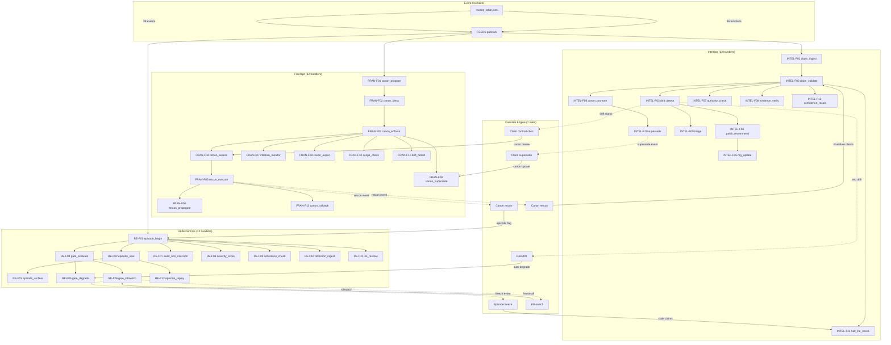

# 24 — Domain Modes & Cascade Engine

Three executable domain modes (36 function handlers) with cross-domain cascade propagation, event contracts, and deterministic replay.

## Support Modules

| Module | Purpose | File |
|--------|---------|------|
| DomainMode base | `handle()` dispatch + `replay()` | `src/core/modes/base.py` |
| Canon Workflow | PROPOSED→BLESSED→ACTIVE state machine | `src/core/feeds/canon/workflow.py` |
| Retcon Executor | Impact assessment + execution | `src/core/feeds/canon/retcon_executor.py` |
| Inflation Monitor | Canon health thresholds | `src/core/feeds/canon/inflation_monitor.py` |
| Episode State | PENDING→ACTIVE→SEALED→ARCHIVED | `src/core/episode_state.py` |
| Severity Scorer | Centralized drift severity | `src/core/severity.py` |
| Audit Log | Hash-chained NDJSON | `src/core/audit_log.py` |
| Killswitch | Emergency freeze + halt proof | `src/core/killswitch.py` |
| Cascade Rules | 7 declarative CascadeRule objects | `src/core/modes/cascade_rules.py` |
