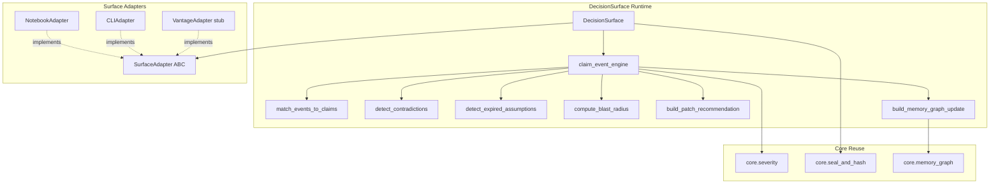
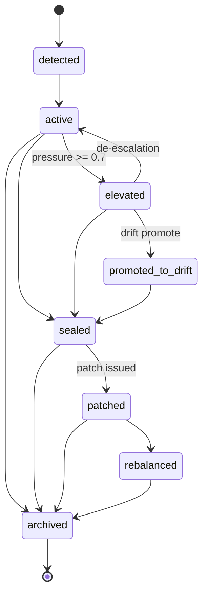

# 24 — Domain Modes, Cascade Engine & DecisionSurface

Six executable domain modes (79 function handlers) with cross-domain cascade propagation, event contracts, deterministic replay, and portable DecisionSurface runtime.

```mermaid
graph TB
    subgraph "IntelOps (12 handlers)"
        IF01[INTEL-F01 claim_ingest] --> IF02[INTEL-F02 claim_validate]
        IF02 --> IF03[INTEL-F03 drift_detect]
        IF03 --> IF04[INTEL-F04 patch_recommend]
        IF04 --> IF05[INTEL-F05 mg_update]
        IF02 --> IF06[INTEL-F06 canon_promote]
        IF02 --> IF07[INTEL-F07 authority_check]
        IF02 --> IF08[INTEL-F08 evidence_verify]
        IF03 --> IF09[INTEL-F09 triage]
        IF06 --> IF10[INTEL-F10 supersede]
        IF02 --> IF11[INTEL-F11 half_life_check]
        IF02 --> IF12[INTEL-F12 confidence_recalc]
    end

    subgraph "FranOps (12 handlers)"
        FF01[FRAN-F01 canon_propose] --> FF02[FRAN-F02 canon_bless]
        FF02 --> FF03[FRAN-F03 canon_enforce]
        FF03 --> FF04[FRAN-F04 retcon_assess]
        FF04 --> FF05[FRAN-F05 retcon_execute]
        FF05 --> FF06[FRAN-F06 retcon_propagate]
        FF03 --> FF07[FRAN-F07 inflation_monitor]
        FF03 --> FF08[FRAN-F08 canon_expire]
        FF03 --> FF09[FRAN-F09 canon_supersede]
        FF03 --> FF10[FRAN-F10 scope_check]
        FF03 --> FF11[FRAN-F11 drift_detect]
        FF05 --> FF12[FRAN-F12 canon_rollback]
    end

    subgraph "ReflectionOps (12 handlers)"
        RF01[RE-F01 episode_begin] --> RF02[RE-F02 episode_seal]
        RF02 --> RF03[RE-F03 episode_archive]
        RF01 --> RF04[RE-F04 gate_evaluate]
        RF04 --> RF05[RE-F05 gate_degrade]
        RF04 --> RF06[RE-F06 gate_killswitch]
        RF01 --> RF07[RE-F07 audit_non_coercion]
        RF01 --> RF08[RE-F08 severity_score]
        RF01 --> RF09[RE-F09 coherence_check]
        RF01 --> RF10[RE-F10 reflection_ingest]
        RF01 --> RF11[RE-F11 iris_resolve]
        RF02 --> RF12[RE-F12 episode_replay]
    end

    subgraph "AuthorityOps (19 handlers)"
        AF01[AUTH-F01 action_request_intake] --> AF02[AUTH-F02 actor_resolve]
        AF02 --> AF03[AUTH-F03 resource_resolve]
        AF03 --> AF04[AUTH-F04 policy_load]
        AF04 --> AF05[AUTH-F05 dlr_presence_check]
        AF05 --> AF06[AUTH-F06 assumption_validate]
        AF06 --> AF07[AUTH-F07 half_life_check]
        AF07 --> AF08[AUTH-F08 blast_radius_threshold]
        AF08 --> AF09[AUTH-F09 kill_switch_check]
        AF09 --> AF10[AUTH-F10 decision_gate]
        AF10 --> AF11[AUTH-F11 audit_record_emit]
        AF01 --> AF12[AUTH-F12 delegation_chain_validate]
        AF10 --> AF13[AUTH-F13 authority_drift_detect]
        AF08 --> AF14[AUTH-F14 blast_radius_simulate]
        AF14 --> AF15[AUTH-F15 blast_radius_propagate]
        AF15 --> AF16[AUTH-F16 blast_radius_seal]
        AF13 --> AF17[AUTH-F17 drift_history_query]
        AF06 --> AF18[AUTH-F18 assumption_sweep]
        AF13 --> AF19[AUTH-F19 cross_domain_drift_correlate]
    end

    subgraph "ParadoxOps (12 handlers)"
        PF01[PDX-F01 tension_set_create] --> PF03[PDX-F03 dimension_attach]
        PF01 --> PF02[PDX-F02 pole_manage]
        PF03 --> PF04[PDX-F04 dimension_shift]
        PF04 --> PF05[PDX-F05 pressure_compute]
        PF04 --> PF06[PDX-F06 imbalance_compute]
        PF05 --> PF07[PDX-F07 threshold_evaluate]
        PF07 --> PF08[PDX-F08 drift_promote]
        PF07 --> PF09[PDX-F09 interdimensional_drift]
        PF08 --> PF10[PDX-F10 seal_snapshot]
        PF09 --> PF11[PDX-F11 patch_issue]
        PF10 --> PF12[PDX-F12 lifecycle_transition]
        PF11 --> PF12
    end

    subgraph "ActionOps (12 handlers)"
        XF01[ACTION-F01 commitment_intake] --> XF02[ACTION-F02 commitment_validate]
        XF02 --> XF03[ACTION-F03 deliverable_track]
        XF02 --> XF04[ACTION-F04 deadline_check]
        XF02 --> XF05[ACTION-F05 compliance_evaluate]
        XF04 --> XF06[ACTION-F06 risk_assess]
        XF06 --> XF07[ACTION-F07 breach_detect]
        XF07 --> XF08[ACTION-F08 escalation_trigger]
        XF07 --> XF09[ACTION-F09 remediation_recommend]
        XF09 --> XF10[ACTION-F10 commitment_adjust]
        XF03 --> XF11[ACTION-F11 commitment_complete]
        XF02 --> XF12[ACTION-F12 commitment_report]
    end

    subgraph "Cascade Engine (17 rules)"
        C1[Claim contradiction] -->|canon review| FF04
        C2[Claim supersede] -->|canon update| FF09
        C3[Canon retcon] -->|episode flag| RF01
        C4[Canon retcon] -->|invalidate claims| IF02
        C5[Episode freeze] -->|stale claims| IF11
        C6[Kill-switch] -->|freeze all| RF06
        C7[Red drift] -->|auto-degrade| RF05
        C8[Episode sealed] -->|authority eval| AF01
        C9[Authority block] -->|canon enforce| FF03
        C10[Authority escalate] -->|review episode| RF01
        C11[Authority mismatch] -->|delegation check| AF12
        C12[Stale assumptions] -->|confidence recalc| IF12
        C13[Killswitch active] -->|freeze| RF06
        C14[Authority approved] -->|commitment intake| XF01
        C15[Commitment breached] -->|severity score| RF08
        C16[Commitment completed] -->|confidence recalc| IF12
        C17[Commitment escalated] -->|canon enforce| FF03
    end

    subgraph "Event Contracts"
        RT[routing_table.json] --> |79 functions| FEEDS[FEEDS pub/sub]
        RT --> |91 events| FEEDS
        FEEDS --> IF01
        FEEDS --> FF01
        FEEDS --> RF01
        FEEDS --> AF01
        FEEDS --> PF01
        FEEDS --> XF01
    end

    IF03 -.->|drift signal| C1
    IF10 -.->|supersede event| C2
    FF05 -.->|retcon event| C3
    FF05 -.->|retcon event| C4
    RF06 -.->|freeze event| C5
    RF06 -.->|killswitch| C6
    IF03 -.->|red drift| C7
    RF02 -.->|episode sealed| C8
    AF10 -.->|authority block| C9
    AF10 -.->|escalate| C10
    IF07 -.->|authority mismatch| C11
    AF06 -.->|stale assumptions| C12
    AF09 -.->|killswitch active| C13
    AF10 -.->|authority approved| C14
    XF07 -.->|commitment breached| C15
    XF11 -.->|commitment completed| C16
    XF08 -.->|commitment escalated| C17
```

## DecisionSurface Runtime

Portable Coherence Ops runtime — sits above domain modes, no function IDs or routing table entries.

```mermaid
graph TB
    subgraph "DecisionSurface Runtime"
        DS[DecisionSurface] --> CEE[claim_event_engine]
        CEE --> MATCH[match_events_to_claims]
        CEE --> CONTRA[detect_contradictions]
        CEE --> EXPIRE[detect_expired_assumptions]
        CEE --> BLAST[compute_blast_radius]
        CEE --> PATCH[build_patch_recommendation]
        CEE --> MG[build_memory_graph_update]
    end

    subgraph "Surface Adapters"
        SA[SurfaceAdapter ABC]
        NB[NotebookAdapter] -.->|implements| SA
        CLI[CLIAdapter] -.->|implements| SA
        VA[VantageAdapter stub] -.->|implements| SA
    end

    subgraph "Core Reuse"
        SEV[core.severity]
        SEAL[core.seal_and_hash]
        MGR[core.memory_graph]
    end

    DS --> SA
    DS --> SEAL
    CEE --> SEV
    MG --> MGR
```

## ParadoxOps Lifecycle

Tension set lifecycle state machine with pressure-driven promotion.

```mermaid
stateDiagram-v2
    [*] --> detected
    detected --> active
    active --> elevated : pressure >= 0.7
    active --> sealed
    active --> archived
    elevated --> promoted_to_drift : drift promote
    elevated --> sealed
    elevated --> active : de-escalation
    promoted_to_drift --> sealed
    sealed --> patched : patch issued
    sealed --> archived
    patched --> rebalanced
    patched --> archived
    rebalanced --> archived
    archived --> [*]
```

## Support Modules

| Module | Purpose | File |
|--------|---------|------|
| DomainMode base | `handle()` dispatch + `replay()` | `src/core/modes/base.py` |
| Canon Workflow | PROPOSED→BLESSED→ACTIVE state machine | `src/core/feeds/canon/workflow.py` |
| Retcon Executor | Impact assessment + execution | `src/core/feeds/canon/retcon_executor.py` |
| Inflation Monitor | Canon health thresholds | `src/core/feeds/canon/inflation_monitor.py` |
| Episode State | PENDING→ACTIVE→SEALED→ARCHIVED | `src/core/episode_state.py` |
| Severity Scorer | Centralized drift severity | `src/core/severity.py` |
| Audit Log | Hash-chained NDJSON | `src/core/audit_log.py` |
| Killswitch | Emergency freeze + halt proof | `src/core/killswitch.py` |
| Cascade Rules | 17 declarative CascadeRule objects | `src/core/modes/cascade_rules.py` |
| Authority Models | AuthorityOps dataclasses + verdicts | `src/core/authority/models.py` |
| Policy Runtime | 11-step authority evaluation pipeline | `src/core/authority/policy_runtime.py` |
| Authority Audit | Hash-chained authority audit log | `src/core/authority/authority_audit.py` |
| ParadoxOps Models | Tension set, pole, dimension dataclasses | `src/core/paradox_ops/models.py` |
| Dimension Registry | 6 common + 10 uncommon dimensions | `src/core/paradox_ops/dimensions.py` |
| Tension Lifecycle | 8-state machine for tension sets | `src/core/paradox_ops/lifecycle.py` |
| ActionOps Models | Commitment, deliverable, compliance dataclasses | `src/core/action_ops/models.py` |
| Commitment Registry | In-memory commitment store | `src/core/action_ops/registry.py` |
| Commitment Lifecycle | 8-state machine for commitments | `src/core/action_ops/lifecycle.py` |
| DecisionSurface | Portable runtime with adapter ABC | `src/core/decision_surface/runtime.py` |
| Claim-Event Engine | Shared evaluation logic (7 functions) | `src/core/decision_surface/claim_event_engine.py` |
