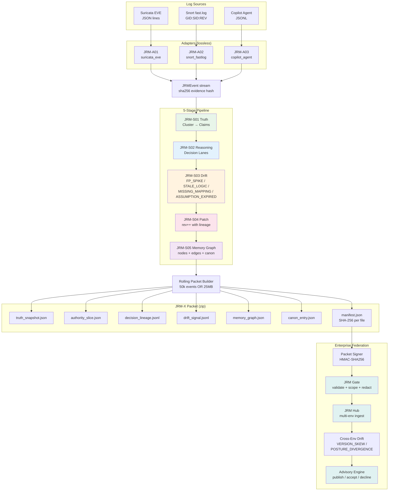

# 25 — JRM Pipeline & Federation

Log-agnostic Judgment Refinement Module: 3 adapters, 5-stage coherence pipeline, JRM-X packet builder, and enterprise cross-environment federation.

## CLI Commands

| Command | Stage |
|---------|-------|
| `coherence jrm ingest` | Adapter → NDJSON |
| `coherence jrm run` | Pipeline → Packets |
| `coherence jrm validate` | Packet verification |
| `coherence jrm adapters` | List adapters |
| `deepsigma jrm federate` | Cross-env federation |
| `deepsigma jrm gate validate` | Gate validation |
| `deepsigma jrm hub replay` | Hub replay |
| `deepsigma jrm advisory publish` | Advisory workflow |

## Support Modules

| Module | Purpose | File |
|--------|---------|------|
| Adapter base | `parse_line()` + `parse_stream()` + `hash_raw()` | `src/core/jrm/adapters/base.py` |
| Adapter registry | `register_adapter()` + `get_adapter()` | `src/core/jrm/adapters/registry.py` |
| Pipeline runner | Chain 5 stages with error tolerance | `src/core/jrm/pipeline/runner.py` |
| Packet naming | `JRM_X_PACKET_<ENV>_<start>_<end>_partNN` | `src/core/jrm/packet/naming.py` |
| Manifest builder | SHA-256 per file + metadata | `src/core/jrm/packet/manifest.py` |
| Rolling builder | Hybrid threshold auto-flush | `src/core/jrm/packet/builder.py` |
| Extension hooks | Drift detectors, validators, connectors, CLI | `src/core/jrm/hooks/registry.py` |
| Federation gate | Integrity + scope + redaction | `enterprise/src/deepsigma/jrm_ext/federation/gate.py` |
| Federation hub | Multi-env ingest + drift detect | `enterprise/src/deepsigma/jrm_ext/federation/hub.py` |
| Advisory engine | Publish/accept/decline lifecycle | `enterprise/src/deepsigma/jrm_ext/federation/advisory.py` |
| Packet signer | HMAC-SHA256 canonical JSON | `enterprise/src/deepsigma/jrm_ext/security/signer.py` |
