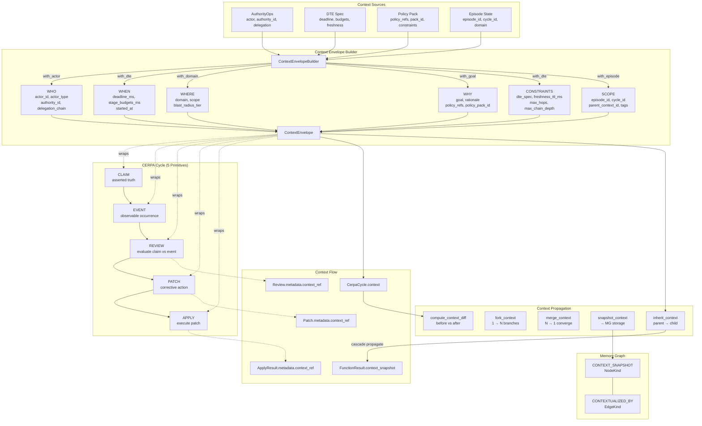

# 26 — CERPA Cognitive Engine & Context Envelope

Context Envelope wraps every CERPA cycle — carrying WHO, WHEN, WHERE, WHY, CONSTRAINTS, and SCOPE through the five-primitive adaptation loop. Context is NOT a primitive; it is ambient infrastructure.

## Context Is NOT a Primitive

The ContextEnvelope is a transport type — it flows through the system but:
- Has no `primitive_type` field
- Is not in the `PrimitiveType` enum
- Never calls `wrap_primitive()`
- Is not counted by the Five-Primitive Guard

## Six Context Dimensions

| Dimension | Fields | Source |
|-----------|--------|--------|
| **WHO** | `actor_id`, `actor_type`, `authority_id`, `delegation_chain` | AuthorityOps |
| **WHEN** | `deadline_ms`, `stage_budgets_ms`, `started_at` | DTE Spec |
| **WHERE** | `domain`, `scope`, `blast_radius_tier` | Episode / Domain Mode |
| **WHY** | `goal`, `rationale`, `policy_refs`, `policy_pack_id` | Policy Pack |
| **CONSTRAINTS** | `dte_spec`, `freshness_ttl_ms`, `max_hops`, `max_chain_depth`, `action_constraints` | DTE + Policy |
| **SCOPE** | `episode_id`, `cycle_id`, `parent_context_id`, `related_entity_ids`, `tags` | Episode State |

## Propagation Semantics

| Operation | When | Behavior |
|-----------|------|----------|
| **inherit** | Cascade to child domain | New ID, `parent_context_id` → parent, domain override |
| **fork** | Multi-target cascade | N independent branches from one parent |
| **merge** | Converging branches | Primary wins scalars, collections union |
| **snapshot** | MG persistence | Immutable capture with trigger label |
| **diff** | Change tracking | Changed/added/removed field comparison |

## Support Modules

| Module | Purpose | File |
|--------|---------|------|
| ContextEnvelope | 6-dimension ambient context | `src/core/context/models.py` |
| ContextEnvelopeBuilder | Fluent builder from authority/DTE/policy/episode | `src/core/context/builder.py` |
| Context Propagation | inherit, fork, merge, snapshot, diff | `src/core/context/propagation.py` |
| Context Validators | Envelope validation rules | `src/core/context/validators.py` |
