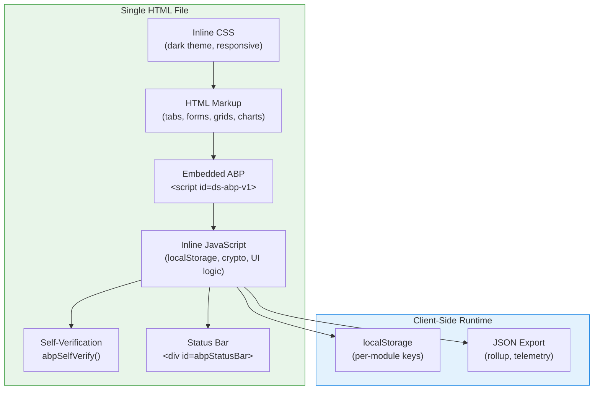
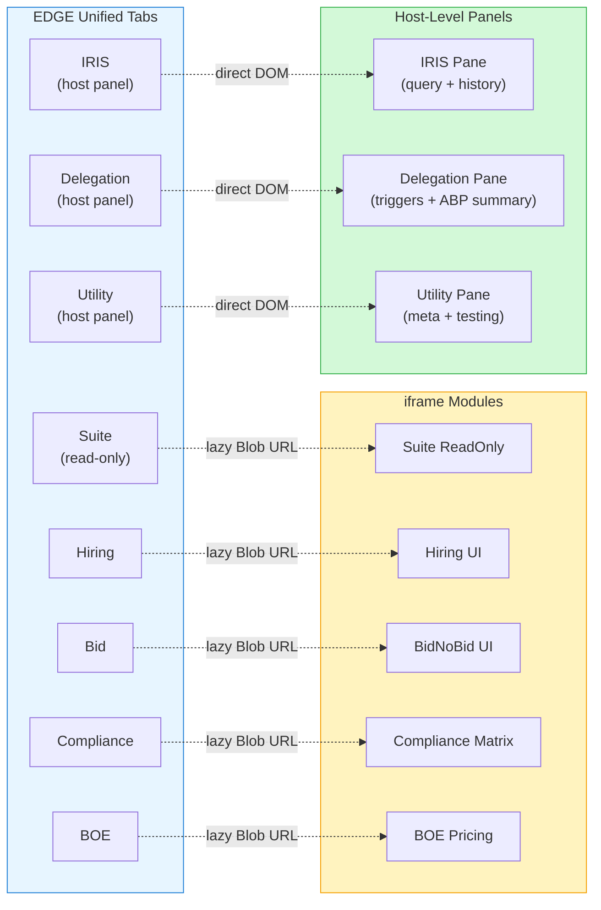

# EDGE Module Reference

> Complete reference for all 8 EDGE modules — standalone HTML decision surfaces with embedded ABP governance.

## Table of Contents

- [Module Architecture](#module-architecture)
- [EDGE Unified](#edge-unified)
- [Coherence Dashboard](#coherence-dashboard)
- [Hiring UI](#hiring-ui)
- [Bid/NoBid UI](#bidnobid-ui)
- [BOE Pricing UI](#boe-pricing-ui)
- [Compliance Matrix UI](#compliance-matrix-ui)
- [Award Staffing Estimator](#award-staffing-estimator)
- [Suite ReadOnly](#suite-readonly)
- [Domino Delegation Encryption](#domino-delegation-encryption)
- [Common Patterns](#common-patterns)

---

## Module Architecture

Every EDGE module follows the same structural pattern:



### Common Elements

Every EDGE module includes:

| Element | Purpose |
|---------|---------|
| `<script id="ds-abp-v1">` | Embedded ABP JSON — governance declaration |
| `<div id="abpStatusBar">` | Visual ABP status indicator (valid/invalid/missing) |
| `abpSelfVerify()` | Client-side hash verification on load |
| `readJsonSafe()` / `writeJsonSafe()` | Safe localStorage access with JSON parse/stringify |
| `escapeHtml()` | XSS prevention for dynamic content |
| Dark theme CSS | Consistent visual language (#1a1a2e backgrounds, accent colors) |

---

## EDGE Unified

**File:** `EDGE_Unified_v1.0.0.html` | **Version:** 1.0.0 | **Module:** `unified` | **Lines:** ~4,300

The master control surface that aggregates all decision modules into a single tabbed interface.

### Tab System



### Tab Types

| Tab | Type | Description |
|-----|------|-------------|
| **Suite** | iframe | Read-only unified view with telemetry rollup |
| **Hiring** | iframe | Staffing intake forms, candidate pipeline |
| **Bid** | iframe | Bid/no-bid scoring matrix |
| **Compliance** | iframe | Requirement-to-deliverable mapping |
| **BOE** | iframe | Basis-of-estimate rate calculations |
| **IRIS** | host panel | Operator query resolution engine (WHY, WHAT_CHANGED, WHAT_DRIFTED, RECALL, STATUS) |
| **Delegation** | host panel | Delegation review trigger board with 4 DRT evaluators |
| **Utility** | host panel | Meta-information, testing utilities, localStorage management |

### IRIS Panel

The IRIS (Intelligent Resolution and Insight System) panel provides natural language query resolution:

- **Input:** `irisQuery` text box with `irisGo` button
- **Query types:** WHY, WHAT_CHANGED, WHAT_DRIFTED, RECALL, STATUS
- **Output:** `irisResult` div with structured response (summary, provenance, confidence)
- **History:** `irisHistoryList` tracks previous queries and responses

### Delegation Panel

The Delegation panel evaluates ABP reassessment triggers in real-time:

- **Trigger Board:** `delegTriggerGrid` — 2-column grid of DRT-001 through DRT-004 cards
- **ABP Summary:** `delegAbpSummary` — current ABP ID, hash, scope, authority ref
- **Review History:** `delegReviewHistory` — audit log of past reviews
- **Trigger States:** armed (threshold approaching), tripped (condition met), clear (below threshold)

### ABP Context Bar

The ABP context bar (`ABP_TAB_MAP`) displays tab-specific governance context:

| Tab | Context Shown |
|-----|--------------|
| Suite | Read-only scope, all modules listed |
| Hiring | OBJ-001/002 (staffing), hiring data permissions |
| Bid | OBJ-001 (bid evaluation), bid data permissions |
| Compliance | OBJ-003 (compliance mapping), compliance data permissions |
| BOE | OBJ-004 (pricing), boe data permissions |
| IRIS | IRIS query types, confidence sources |
| Delegation | DRT triggers, review policy |
| Utility | Full ABP hash, module list, verification status |

### Key Registry

The `KEY_REGISTRY` maps tabs to their localStorage keys for the Utility panel's data management:

```
suite:       ['ds_suite_readonly_state_v1']
hiring:      ['ds_hiring_v1', 'ds_hiring_candidates_v1']
bid:         ['ds_bid_v1', 'ds_bid_opportunities_v1']
compliance:  ['ds_compliance_v1', 'ds_compliance_items_v1']
boe:         ['ds_boe_v1', 'ds_boe_rates_v1']
delegation:  ['ds_delegation_review_state_v1', 'ds_abp_v1']
utility:     ['ds_utility_meta_v1']
```

---

## Coherence Dashboard

**File:** `EDGE_Coherence_Dashboard_v2.0.0.html` | **Version:** 2.0.0 | **Module:** `coherence` | **Lines:** ~6,700

The largest EDGE module by line count. Provides comprehensive coherence monitoring with four tabs.

### Dashboard Tabs

| Tab | Key Elements | Purpose |
|-----|-------------|---------|
| **Overview** | CI gauge (0-100, A-F grade), metrics grid, activity feed, health donut (green/yellow/red), bar chart | System health at a glance |
| **Claims** | Search, type/status filters, bulk action table | Inspect and manage claims |
| **Drift** | Drift total badge, type distribution chart, severity breakdown, signal list | Monitor active drift signals |
| **Analysis** | Trend chart (SVG time series), half-life calendar, decay claim counter, decay chart | Historical trends and lifecycle analysis |

### Coherence Index (CI)

The CI is a 0-100 composite score with letter grading:

| Range | Grade | Color |
|-------|-------|-------|
| 90-100 | A | Green |
| 80-89 | B | Green |
| 70-79 | C | Yellow |
| 60-69 | D | Yellow |
| 0-59 | F | Red |

CI components aggregate from DLR (Decision Ledger Records), RS (Reflection Sessions), DS (Drift Signals), and MG (Memory Graph) dimension scores.

### Drift Signal Format

Each drift signal displayed in the dashboard includes:

| Field | Description |
|-------|-------------|
| `fingerprint` | Hash of root cause (for deduplication) |
| `type` | Category: functional, data, assumption, policy, authority, coherence |
| `severity` | GREEN / YELLOW / RED |
| `episode_id` | When detected |
| `timestamp` | Observation time |
| `context` | Relevant claim/decision data |

### Analysis Visualizations (v2.0.0)

Four visualization cards added in v2.0.0:

1. **Trend Chart** — SVG time series of CI scores over time with color-coded threshold bands
2. **Half-Life Calendar** — Heatmap showing claim decay rates across calendar days
3. **Decay Counter** — Real-time count of claims approaching or past their assumption half-life
4. **Decay Chart** — Bar chart of decay distribution by claim type

---

## Hiring UI

**File:** `EDGE_Hiring_UI_v1.0.0.html` | **Version:** 1.0.0 | **Module:** `hiring` | **Lines:** ~3,000

Form-driven staffing intake console for tracking candidates, positions, and hiring pipeline stages.

- **Objectives:** OBJ-001 (Evaluate bid/no-bid), OBJ-002 (Assess staffing readiness)
- **Data Sensitivity:** Confidential (hiring_console/*)
- **Operations:** Read + Write (Operator role)

---

## Bid/NoBid UI

**File:** `EDGE_BidNoBid_UI_v1.0.0.html` | **Version:** 1.0.0 | **Module:** `bid` | **Lines:** ~1,600

Bid/no-bid decision matrix for evaluating opportunities against organizational capabilities.

- **Objectives:** OBJ-001 (Evaluate bid/no-bid for DEC-001)
- **Data Sensitivity:** Confidential (bid_console/*)
- **Operations:** Read + Write (Operator role)

---

## BOE Pricing UI

**File:** `EDGE_BOE_Pricing_UI_v1.0.0.html` | **Version:** 1.0.0 | **Module:** `boe` | **Lines:** ~1,200

Basis-of-estimate pricing models with rate calculations and labor category management.

- **Objectives:** OBJ-004 (Generate basis-of-estimate pricing models)
- **Data Sensitivity:** Confidential (boe_pricing/*)
- **Operations:** Read + Write (Operator role)

---

## Compliance Matrix UI

**File:** `EDGE_ComplianceMatrix_UI_v1.0.0.html` | **Version:** 1.0.0 | **Module:** `compliance` | **Lines:** ~1,200

Maps compliance requirements to deliverables with coverage tracking and gap analysis.

- **Objectives:** OBJ-003 (Map compliance requirements to deliverables)
- **Data Sensitivity:** Confidential (compliance_matrix/*)
- **Operations:** Read + Write (Operator role)

---

## Award Staffing Estimator

**File:** `EDGE_AwardStaffing_Estimator_v1.2.0.html` | **Version:** 1.2.0 | **Module:** `award_staffing` | **Lines:** ~1,500

Estimates staffing allocation and costs for contract awards.

- **Objectives:** OBJ-005 (Estimate award staffing allocation and costs)
- **Data Sensitivity:** Internal (award_staffing/*)
- **Operations:** Read + Write (Operator role)

---

## Suite ReadOnly

**File:** `EDGE_Suite_ReadOnly_v1.0.0.html` | **Version:** 1.0.0 | **Module:** `suite_readonly` | **Lines:** ~1,400

Read-only wrapper providing telemetry rollup and export capabilities without write access.

- **Objectives:** OBJ-007 (Present read-only unified decision surface)
- **Data Sensitivity:** Internal (decision_log.csv — read only)
- **Operations:** Read (Operator role)

---

## Domino Delegation Encryption

**File:** `EDGE_Domino_Delegation_Encryption.html` | **Version:** 1.0.0 | **Module:** `domino` | **Lines:** ~2,500

Air-gapped ceremony orchestration for 4-of-7 Shamir threshold encryption using physical dominoes as co-presence proof. EDGE-hardened (v1.1) with CSP, runtime shim, and action contract.

### Wizard Steps

| Step | Purpose |
|------|---------|
| **1. Self-Test** | GF(256) arithmetic, Shamir roundtrip, Base64 encoding verification — must pass before ceremony |
| **2. Chain Ceremony** | 7 participants enter physical domino tiles; tool validates chaining and computes SHA-256 seal |
| **3. Keywords** | Generate 7 Shamir shares (4-of-7 threshold). Each keyword has fingerprint. TTL starts (1 hour) |
| **4. Majority Unlock** | Paste 4+ keywords (within TTL) to reconstruct secret; fingerprint verification against ceremony JSON |
| **5. Encrypt/Decrypt** | Three tabs: Verify (ceremony record), Lock (AES-256-GCM encrypt), Unlock (decrypt) |

### Key Features

- **Shamir Secret Sharing:** 4-of-7 threshold over GF(256) with AES irreducible polynomial
- **Physical co-presence:** Domino tiles must chain (right side = left side of next)
- **TTL enforcement:** Keywords valid for 1 hour from generation
- **HKDF key derivation:** Secret + SHA-256(passphrase) → AES-256-GCM key
- **Anti-leak UX:** Press-and-hold reveal, type "COPY" to copy, clipboard overwrite
- **Ceremony JSON:** Public record with chain seal, fingerprints, session ID, TTL — never keywords or secret
- **Self-test gate:** Cryptographic primitives verified before any keys are generated

### Verifier (Core Edition)

**File:** `EDGE_Domino_Delegation_Encryption_Verifier.html` | **Module:** `domino_verifier`

Read-only verification tool. Loads ceremony JSON and checks: chain connectivity, seal recomputation (SHA-256), TTL status, session ID, keyword fingerprints. Copy buttons for non-secret values. Cannot generate keywords, unlock, or encrypt.

### Runbook

See [enterprise/docs/edge/domino-delegation-encryption.md](../../docs/edge/domino-delegation-encryption.md) for operational procedures, security rules, and troubleshooting.

---

## Common Patterns

### ABP Self-Verification

Every module runs `abpSelfVerify()` on page load:

1. Extract ABP JSON from `<script id="ds-abp-v1">`
2. Parse JSON
3. Compute canonical hash: `sha256(canonical(abp with hash=""))`
4. Compare against `abp.hash` field
5. Update `abpStatusBar` with result (VALID / INVALID / MISSING)

### localStorage Isolation

Each module uses prefixed keys to prevent collisions:

- Pattern: `ds_{module}_{data_type}_v{version}`
- Examples: `ds_hiring_v1`, `ds_bid_opportunities_v1`, `ds_boe_rates_v1`
- Utilities: `readJsonSafe(key, fallback)` / `writeJsonSafe(key, value)` with `invalidateJsonCache(key)`

### Host Rollup

`buildHostRollup()` aggregates telemetry across all modules:

- Reads from all localStorage keys in `KEY_REGISTRY`
- Computes summary metrics (record counts, last-modified timestamps)
- Used by Utility tab for export and by DRT-002 evaluator for gate failure counting

### Blob URL Loading

Iframe-based modules use lazy Blob URL loading:

1. Module HTML content stored as template literal in Unified's JS
2. On first tab activation, creates `new Blob([html], {type: 'text/html'})`
3. Sets iframe `src` to `URL.createObjectURL(blob)`
4. Subsequent activations reuse the cached Blob URL
