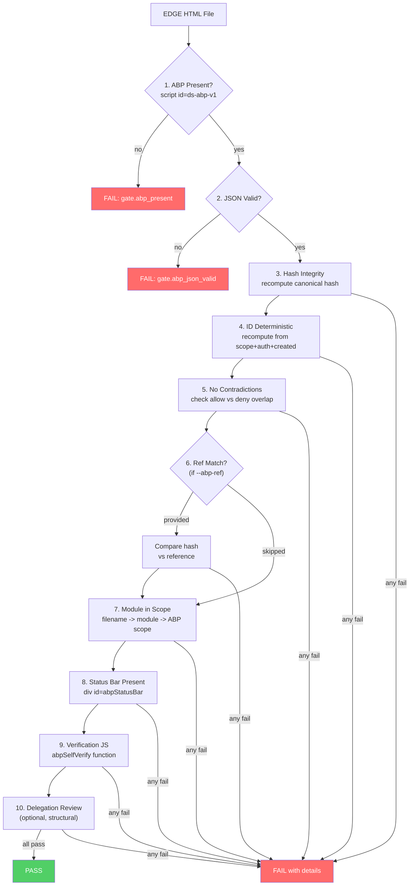

# Gate Enforcement

> `gate_abp.py` — host-level enforcement gate that verifies every EDGE HTML export carries a valid, embedded ABP before distribution or deployment.

## Table of Contents

- [Overview](#overview)
- [Gate Pipeline](#gate-pipeline)
- [File-to-Module Mapping](#file-to-module-mapping)
- [Gate Checks](#gate-checks)
- [CLI Usage](#cli-usage)
- [JSON Output Format](#json-output-format)
- [CI/CD Integration](#cicd-integration)

---

## Overview

Before any EDGE export is distributed, `gate_abp.py` validates that:

1. An ABP is present in the HTML
2. The ABP is valid JSON
3. The ABP hash and ID are correct (not tampered)
4. No contradictions exist in allow/deny lists
5. The ABP matches a reference artifact (if provided)
6. The module is within the ABP's declared scope
7. Self-verification UI elements are present
8. Delegation review section is structurally valid (if present)

The gate runs **10 checks per file across 8 files = 80 total checks**.

## Gate Pipeline



## File-to-Module Mapping

The gate maps EDGE filenames to their expected ABP module:

| Filename Prefix | ABP Module |
|-----------------|------------|
| `EDGE_Hiring_UI` | `hiring` |
| `EDGE_BidNoBid_UI` | `bid` |
| `EDGE_ComplianceMatrix_UI` | `compliance` |
| `EDGE_BOE_Pricing_UI` | `boe` |
| `EDGE_AwardStaffing_Estimator` | `award_staffing` |
| `EDGE_Coherence_Dashboard` | `coherence` |
| `EDGE_Suite_ReadOnly` | `suite_readonly` |
| `EDGE_Unified` | `unified` |

This mapping is defined in `FILE_MODULE_MAP` in `gate_abp.py`.

## Gate Checks

| # | Check Name | Pass Condition | Blocking |
|---|-----------|----------------|----------|
| 1 | `gate.abp_present` | `<script id="ds-abp-v1">` block found in HTML | Yes (early exit) |
| 2 | `gate.abp_json_valid` | Embedded JSON parses without error | Yes (early exit) |
| 3 | `gate.abp_hash_integrity` | `sha256(canonical(abp with hash=""))` matches `abp.hash` | Yes |
| 4 | `gate.abp_id_deterministic` | `ABP-` + sha256(canonical(scope+auth_ref+created_at))[:8] matches `abp.abp_id` | Yes |
| 5 | `gate.abp_no_contradictions` | No objective ID in both `allowed[]` and `denied[]`; no tool name in both `allow[]` and `deny[]` | Yes |
| 6 | `gate.abp_ref_match` | `abp.hash` matches reference ABP hash (only when `--abp-ref` provided) | Yes |
| 7 | `gate.module_in_scope` | Module derived from filename exists in `abp.scope.modules[]` | Yes |
| 8 | `gate.status_bar_present` | `<div id="abpStatusBar">` found in HTML | Yes |
| 9 | `gate.verification_js_present` | `abpSelfVerify` function found in HTML | Yes |
| 10 | `gate.delegation_review_present` | When present: has triggers + policy.approver_role; when absent: passes (optional) | Informational |

### ABP Extraction

The embedded ABP is extracted via regex:

```python
r'<script\s+type=["\']application/json["\']\s+id=["\']ds-abp-v1["\']>\s*(.*?)\s*</script>'
```

This matches the embedded ABP block regardless of quote style (single or double).

## CLI Usage

### Check a single file

```bash
python edge/gate_abp.py --file edge/EDGE_Hiring_UI_v1.0.0.html
```

### Check all EDGE files in a directory

```bash
python edge/gate_abp.py --dir edge/
```

### Strict mode with reference ABP

```bash
python edge/gate_abp.py --dir edge/ --strict --abp-ref edge/abp_v1.json
```

When `--abp-ref` is provided, check #6 (`gate.abp_ref_match`) verifies the embedded ABP hash matches the reference file.

### JSON output

```bash
python edge/gate_abp.py --dir edge/ --json
```

### All flags

| Flag | Description |
|------|-------------|
| `--file PATH` | Check a single EDGE HTML file |
| `--dir PATH` | Check all `EDGE_*.html` files in directory |
| `--abp-ref PATH` | Reference `abp_v1.json` to compare against |
| `--strict` | Treat warnings as failures |
| `--json` | Output results as JSON |

`--file` and `--dir` are mutually exclusive (one required).

## JSON Output Format

```json
{
    "files": {
        "EDGE_Hiring_UI_v1.0.0.html": [
            {
                "check": "gate.abp_present",
                "pass": true,
                "detail": "<script id=\"ds-abp-v1\"> found"
            },
            {
                "check": "gate.abp_json_valid",
                "pass": true,
                "detail": "Valid JSON (17 fields)"
            }
        ]
    },
    "summary": {
        "total_files": 8,
        "total_checks": 80,
        "passed": 80,
        "failed": 0,
        "result": "PASS"
    }
}
```

## CI/CD Integration

The gate can be integrated into CI/CD pipelines:

```yaml
# Example GitHub Actions step
- name: ABP Gate Check
  run: |
    python edge/gate_abp.py --dir edge/ --abp-ref edge/abp_v1.json --strict
```

Exit codes:

| Code | Meaning |
|------|---------|
| `0` | All gates passed |
| `1` | One or more gates failed |
| `2` | File/directory not found |

The gate imports `_compute_abp_hash` and `_compute_abp_id` from `build_abp.py` to ensure hash and ID computation is consistent with the builder.
