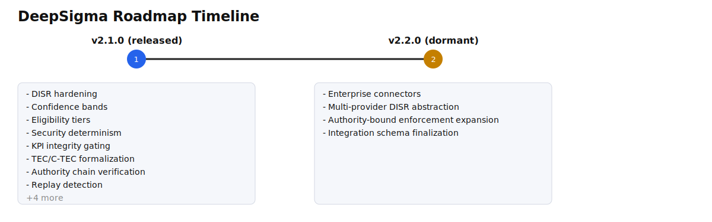

# Roadmap Timeline

## v2.1.0 (active)
- DISR hardening
- Confidence bands
- Eligibility tiers
- Security determinism
- KPI integrity gating
- TEC/C-TEC formalization

## v2.1.1 (dormant)
- Enterprise connectors
- Multi-provider DISR abstraction
- Authority-bound enforcement expansion
- Integration schema finalization
