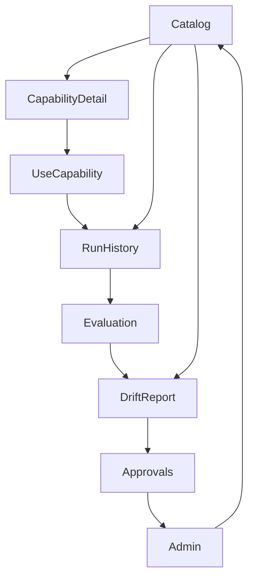

# MDPT Power Apps Screen Map

> 8-screen canvas app for governed prompt operations.
>
> **Governance framework:** [docs/excel-first/multi-dim-prompting-for-teams/](../../docs/excel-first/multi-dim-prompting-for-teams/README.md)
> | **Deployment guide:** [mdpt/docs/power_app_deployment.md](../docs/power_app_deployment.md)

---

## Screen Navigation

---

## Data Bindings

| Screen | Primary Source | Secondary Source |
|--------|---------------|------------------|
| Catalog | PromptCapabilities | — |
| CapabilityDetail | PromptCapabilities | PromptRuns (count) |
| UseCapability | PromptCapabilities | — |
| RunHistory | PromptRuns | — |
| Evaluation | PromptRuns | DriftPatches (related) |
| DriftReport | DriftPatches | PromptRuns (context) |
| Approvals | DriftPatches | — |
| Admin | All lists | — |

---

## Control Inventory

| Screen | Key Controls | PowerFx File |
|--------|-------------|--------------|
| Catalog | SearchBox, LensFilter, RiskFilter, CatalogGallery | `catalog_gallery.pfx`, `filters_sort.pfx` |
| CapabilityDetail | HeaderTitle, PromptTemplate, OpenMatrixBtn, StartRunBtn | `use_capability.pfx` |
| UseCapability | PlatformDropdown, FindingsInput, DriftToggle, SubmitRunBtn | `submit_run.pfx` |
| RunHistory | RunGallery, DriftOnlyToggle | — |
| Evaluation | FindingsSummary, StatsBar, FlagDriftBtn | — |
| DriftReport | DriftTypeDropdown, SeverityDropdown, SubmitDriftBtn | `drift_report.pfx` |
| Approvals | StatusTabs, PatchGallery, ApproveBtn, RejectBtn | `approvals_queue.pfx` |
| Admin | UserRoleLabel, RefreshDataBtn, ExportIndexBtn | — |

---

## Responsive Layout

- **Desktop/tablet:** 2-column layout (sidebar nav + content)
- **Mobile:** Single column with bottom nav bar
- **Min width:** 320px (phone)

---

## See Also

- [Starter Kit](STARTER_KIT.md) — full screen-by-screen build guide
- [Power Automate Flows](../../docs/excel-first/multi-dim-prompting-for-teams/POWER_AUTOMATE_FLOWS.md)
