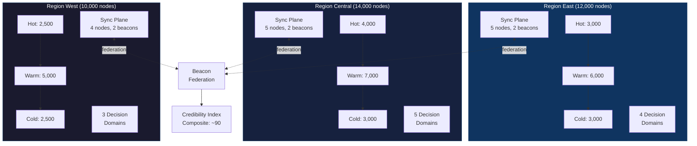
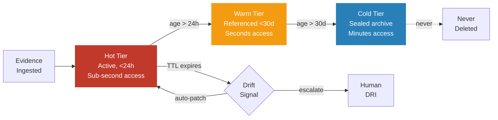
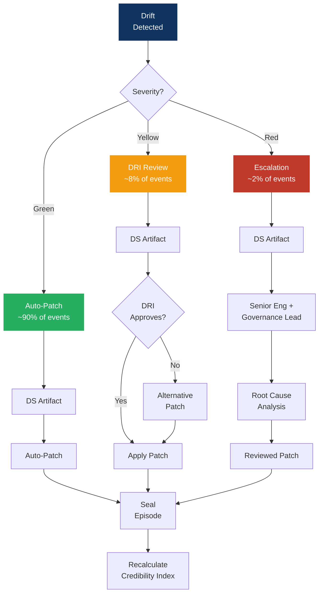
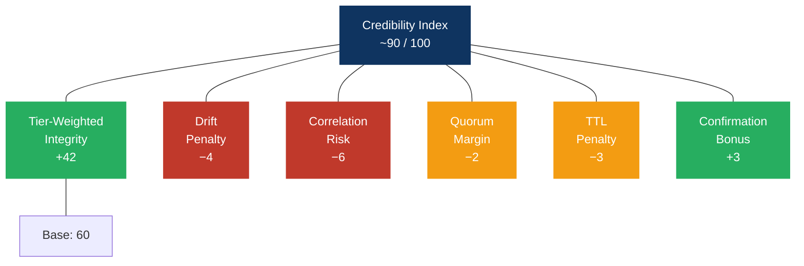
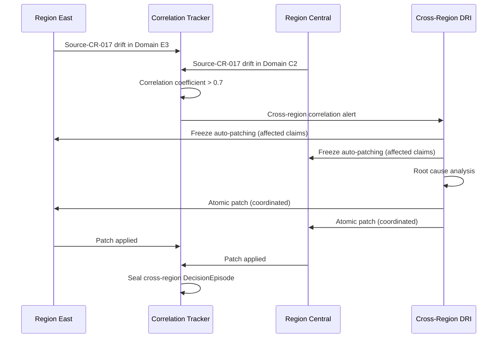

# Diagrams — Production Scale

> Visual architecture for a 30,000–40,000 node Credibility Engine.

---

## Regional Architecture

---

## Evidence Temperature Flow

---

## Drift Triage at Scale

---

## Credibility Index Components

---

## Cross-Region Correlation Detection

---

## Related Diagrams

- [38 — Lattice Architecture](../../mermaid/38-lattice-architecture.md) — Claim → SubClaim → Evidence → Source with Sync Plane and Credibility Index
- [39 — Institutional Drift Loop](../../mermaid/39-drift-loop.md) — Detection → Response → Repair at institutional scale
