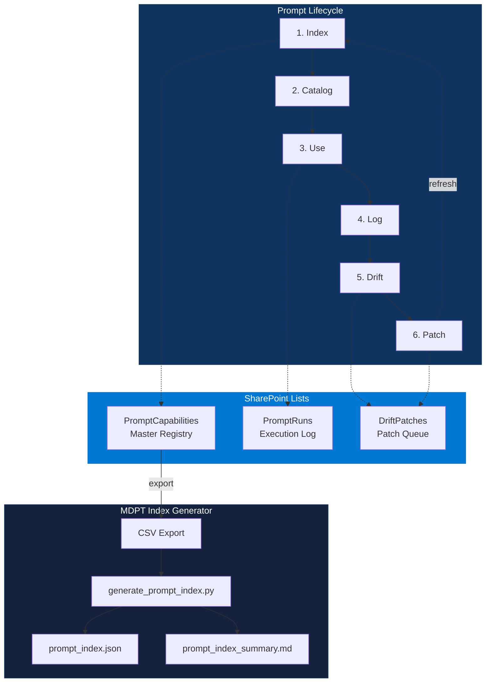

# MDPT — Multi-Dimensional Prompting for Teams

> Registry, tooling, and Power App starter kit for governed prompt operations on SharePoint + Power Platform.

---

## Lifecycle



---

## Index Generator

Convert a PromptCapabilities SharePoint list export (CSV) into a validated, deterministic index:

```bash
# Via the product CLI
deepsigma mdpt index --csv prompt_export.csv --out out/mdpt

# Or directly
python mdpt/tools/generate_prompt_index.py --csv prompt_export.csv --out out/mdpt
```

**Outputs:**
- `prompt_index.json` — machine-readable, schema-validated against `mdpt/templates/prompt_index_schema.json`
- `prompt_index_summary.md` — human-readable rollup with Totals, Expiring Soon, Top Drift, Top Used

**Flags:**
- `--include-nonapproved` — include Draft/Deprecated rows (default: Approved only)

---

## Power App Starter Kit

Build a governed Power App in under 1 hour:

| Resource | Purpose |
|----------|---------|
| [`powerapps/STARTER_KIT.md`](powerapps/STARTER_KIT.md) | Screen-by-screen builder guide |
| [`powerapps/POWERAPPS_SCREEN_MAP.md`](powerapps/POWERAPPS_SCREEN_MAP.md) | Compact screen reference |
| [`powerapps/powerfx/`](powerapps/powerfx/) | 6 copy-paste PowerFx snippet files |

---

## SharePoint Build Sheets

| List | Build Sheet |
|------|-------------|
| PromptCapabilities | [`docs/excel-first/.../SHAREPOINT_LIST_BUILD_SHEET_PromptCapabilities.md`](../docs/excel-first/multi-dim-prompting-for-teams/SHAREPOINT_LIST_BUILD_SHEET_PromptCapabilities.md) |
| PromptRuns | [`docs/excel-first/.../SHAREPOINT_LIST_BUILD_SHEET_PromptRuns.md`](../docs/excel-first/multi-dim-prompting-for-teams/SHAREPOINT_LIST_BUILD_SHEET_PromptRuns.md) |
| DriftPatches | [`docs/excel-first/.../SHAREPOINT_LIST_BUILD_SHEET_DriftPatches.md`](../docs/excel-first/multi-dim-prompting-for-teams/SHAREPOINT_LIST_BUILD_SHEET_DriftPatches.md) |

---

## See Also

- [Power Automate Flows](../docs/excel-first/multi-dim-prompting-for-teams/POWER_AUTOMATE_FLOWS.md)
- [MDPT Governance](../docs/excel-first/multi-dim-prompting-for-teams/GOVERNANCE.md)
- [Workbook Boot Protocol](../docs/excel-first/WORKBOOK_BOOT_PROTOCOL.md)
- [CLI Reference](../docs/CLI.md)
