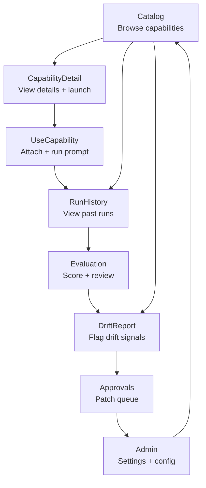

# MDPT Power App Starter Kit

> Build a governed prompt operations app in under 1 hour. No secrets. No tenant URLs. No exported .msapp required.

---

## Prerequisites

1. **SharePoint site** with 3 custom lists built from the build sheets:
   - [PromptCapabilities](../../docs/excel-first/multi-dim-prompting-for-teams/SHAREPOINT_LIST_BUILD_SHEET_PromptCapabilities.md)
   - [PromptRuns](../../docs/excel-first/multi-dim-prompting-for-teams/SHAREPOINT_LIST_BUILD_SHEET_PromptRuns.md)
   - [DriftPatches](../../docs/excel-first/multi-dim-prompting-for-teams/SHAREPOINT_LIST_BUILD_SHEET_DriftPatches.md)
2. **Power Apps license** (standard — no premium connectors needed)
3. **Seed data** — at least 3-5 rows in PromptCapabilities (use the 18-row seed from the build sheet)

---

## Screen Navigation

---

## Step 1: Create the App

1. Open [make.powerapps.com](https://make.powerapps.com)
2. **Create** → **Blank app** → **Blank canvas app** → Tablet layout
3. Name: `MDPT Prompt Ops`
4. **Data** → **Add data** → **SharePoint** → select your site → add all 3 lists

---

## Screen 2: Catalog

**Purpose:** Browse and search all prompt capabilities.

| Control | Type | Property | Value |
|---------|------|----------|-------|
| SearchBox | Text input | Default | `""` |
| LensFilter | Dropdown | Items | `["All","PRIME","EXEC","OPS","AI-TECH","HUMAN","ICON"]` |
| RiskFilter | Dropdown | Items | `["All","ADVISORY","REVIEW","GATE"]` |
| CatalogGallery | Gallery | Items | See `catalog_gallery.pfx` |
| CardTitle | Label | Text | `ThisItem.Title` |
| CardRiskBadge | Label | Text | `ThisItem.Risk_Lane` |
| CardStatus | Label | Text | `ThisItem.Status` |
| LaunchBtn | Button | OnSelect | `Navigate(CapabilityDetail, ScreenTransition.None)` |

> PowerFx: [`powerfx/catalog_gallery.pfx`](powerfx/catalog_gallery.pfx) · [`powerfx/filters_sort.pfx`](powerfx/filters_sort.pfx)

---

## Screen 3: CapabilityDetail

**Purpose:** View full capability details and launch a prompt run.

| Control | Type | Property | Value |
|---------|------|----------|-------|
| HeaderTitle | Label | Text | `varSelectedCap.Title` |
| DescriptionText | Label | Text | `varSelectedCap.Description` |
| TargetTables | Label | Text | `varSelectedCap.Target_Tables` |
| PromptTemplate | Label | Text | `varSelectedCap.Prompt_Template` |
| OpenMatrixBtn | Button | OnSelect | See `use_capability.pfx` — `Launch(...)` |
| StartRunBtn | Button | OnSelect | `Navigate(UseCapability, ScreenTransition.None)` |
| RunCountLabel | Label | Text | Run count from PromptRuns |

> PowerFx: [`powerfx/use_capability.pfx`](powerfx/use_capability.pfx)

---

## Screen 4: UseCapability

**Purpose:** Execute a prompt capability and record the run.

| Control | Type | Property | Value |
|---------|------|----------|-------|
| PlatformDropdown | Dropdown | Items | `["ChatGPT","Claude","Copilot","Other"]` |
| FindingsInput | Text input | Mode | `TextMode.MultiLine` |
| RowsAnalyzed | Text input | Format | `TextFormat.Number` |
| DriftToggle | Toggle | Default | `false` |
| SubmitRunBtn | Button | OnSelect | See `submit_run.pfx` — `Patch(PromptRuns, ...)` |

> PowerFx: [`powerfx/submit_run.pfx`](powerfx/submit_run.pfx)

---

## Screen 5: RunHistory

**Purpose:** View past prompt runs with filtering.

| Control | Type | Property | Value |
|---------|------|----------|-------|
| RunGallery | Gallery | Items | `SortByColumns(Filter(PromptRuns, ...), "Run_Timestamp", SortOrder.Descending)` |
| DriftOnlyToggle | Toggle | Default | `false` |
| RunCard_ID | Label | Text | `ThisItem.Run_ID` |
| RunCard_Platform | Label | Text | `ThisItem.LLM_Platform` |
| RunCard_DriftFlag | Icon | Icon | `If(ThisItem.Drift_Detected, Icon.Warning, Icon.Check)` |

---

## Screen 6: Evaluation

**Purpose:** Review and score a specific run.

| Control | Type | Property | Value |
|---------|------|----------|-------|
| FindingsSummary | Label | Text | `varSelectedRun.Findings_Summary` |
| StatsBar | HorizontalContainer | — | Rows Analyzed, Actions Proposed, Writeback Rows |
| CanonViolations | Label | Text | `varSelectedRun.Canon_Violations` |
| FlagDriftBtn | Button | OnSelect | `Navigate(DriftReport, ScreenTransition.None)` |

---

## Screen 7: DriftReport

**Purpose:** Create a drift signal and assign for resolution.

| Control | Type | Property | Value |
|---------|------|----------|-------|
| DriftTypeDropdown | Dropdown | Items | `["freshness","bypass","verify","outcome","canon_conflict"]` |
| SeverityDropdown | Dropdown | Items | `["LOW","MEDIUM","HIGH","CRITICAL"]` |
| RootCauseInput | Text input | Mode | `TextMode.MultiLine` |
| ProposedActionInput | Text input | Mode | `TextMode.MultiLine` |
| AssignToPicker | ComboBox | Items | `Office365Users.SearchUser({searchTerm: ...})` |
| SubmitDriftBtn | Button | OnSelect | See `drift_report.pfx` — `Patch(DriftPatches, ...)` |

> PowerFx: [`powerfx/drift_report.pfx`](powerfx/drift_report.pfx)

---

## Screen 8: Approvals

**Purpose:** Manage patches through the approval lifecycle.

| Control | Type | Property | Value |
|---------|------|----------|-------|
| StatusTabs | TabList | Items | `["Open","In_Progress","Approved","Closed"]` |
| PatchGallery | Gallery | Items | `Filter(DriftPatches, Status = varSelectedTab)` |
| PatchCard_ID | Label | Text | `ThisItem.Patch_ID` |
| PatchCard_Severity | Label | Text | `ThisItem.Severity` |
| PatchCard_SLA | Label | Text | SLA calculation (see `approvals_queue.pfx`) |
| ApproveBtn | Button | OnSelect | See `approvals_queue.pfx` |
| RejectBtn | Button | OnSelect | See `approvals_queue.pfx` |

> PowerFx: [`powerfx/approvals_queue.pfx`](powerfx/approvals_queue.pfx)

---

## Screen 9: Admin

**Purpose:** App settings and configuration.

| Control | Type | Property | Value |
|---------|------|----------|-------|
| UserRoleLabel | Label | Text | Current user role |
| ListHealthCards | Gallery | Items | Health checks per list |
| RefreshDataBtn | Button | OnSelect | `Refresh(PromptCapabilities); Refresh(PromptRuns); Refresh(DriftPatches)` |
| ExportIndexBtn | Button | OnSelect | Launch to CLI docs for index generation |

---

## Role-Based Views

| Role | Screens Accessible | Key Actions |
|------|-------------------|-------------|
| **Viewer** | Catalog, CapabilityDetail, RunHistory, Evaluation | Read-only |
| **Contributor** | All except Admin | Run prompts, submit runs, flag drift |
| **Approver** | All except Admin | + Approve/reject patches |
| **Admin** | All | + Config, refresh, export |

Implement with `If(varUserRole = "Admin", true, false)` visibility checks on controls.

---

## Reminders

- **No tenant URLs** in PowerFx code — use relative SharePoint references
- **No secrets** — all data stays within your M365 tenant
- **No exported .msapp** required — build from scratch using this guide
- Test with 3-5 rows in each list before scaling

---

## Testing Checklist

- [ ] Catalog gallery loads and filters work (Lens, Risk, Search)
- [ ] Can view capability details and open prompt matrix link
- [ ] Can submit a new prompt run with all required fields
- [ ] Run appears in RunHistory immediately after submission
- [ ] Can flag a drift signal from Evaluation screen
- [ ] Drift appears in Approvals with correct severity
- [ ] Approve/Reject buttons update DriftPatches status
- [ ] Role-based visibility hides Admin screen for non-admins
- [ ] App works on mobile (320px width)

---

## See Also

- [Screen Map](POWERAPPS_SCREEN_MAP.md)
- [Power Automate Flows](../../docs/excel-first/multi-dim-prompting-for-teams/POWER_AUTOMATE_FLOWS.md)
- [MDPT Governance](../../docs/excel-first/multi-dim-prompting-for-teams/GOVERNANCE.md)
