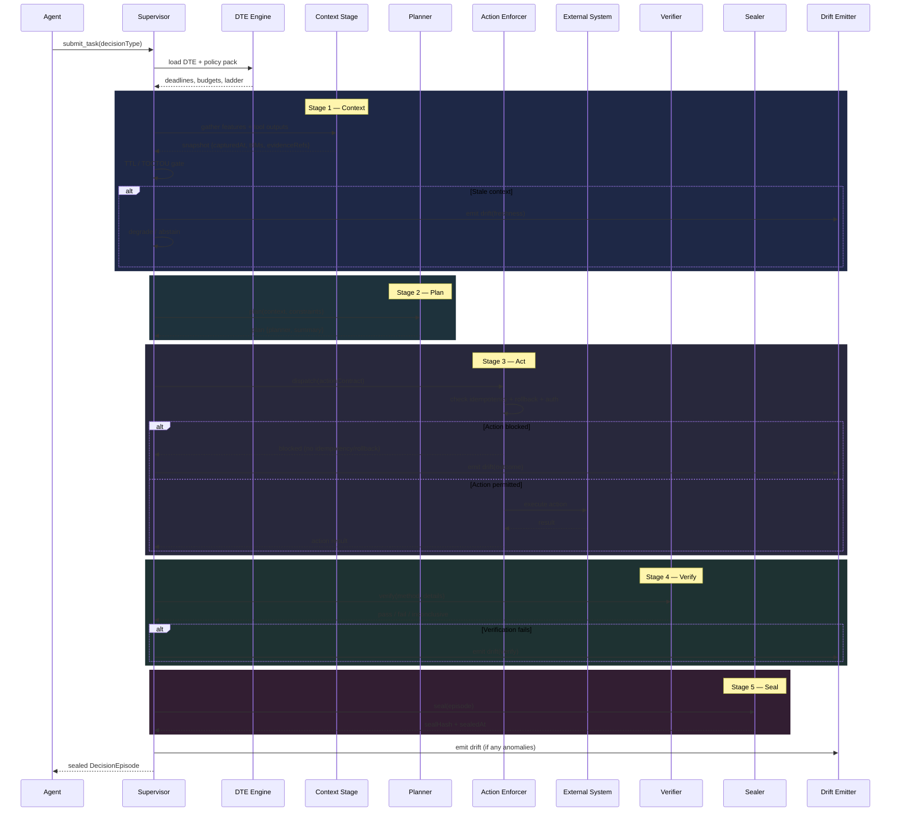

# Runtime Flow

The lifecycle of a supervised decision — from task submission to sealed episode.

```mermaid
sequenceDiagram
    participant Agent
    participant Supervisor
    participant DTE as DTE Engine
    participant Context as Context Stage
    participant Planner
    participant ActionEnf as Action Enforcer
    participant Target as External System
    participant Verifier
    participant Sealer
    participant DriftEm as Drift Emitter

    Agent->>Supervisor: submit_task(decisionType)
    Supervisor->>DTE: load DTE + policy pack
    DTE-->>Supervisor: deadlines, budgets, ladder

    rect rgb(30, 40, 70)
    Note over Context: Stage 1 — Context
    Supervisor->>Context: gather features + tool outputs
    Context-->>Supervisor: snapshot {capturedAt, ttlMs, evidenceRefs}
    Supervisor->>Supervisor: TTL / TOCTOU gate
    alt Stale context
        Supervisor->>DriftEm: emit drift(freshness)
        Supervisor->>Supervisor: degrade / abstain
    end
    end

    rect rgb(30, 50, 60)
    Note over Planner: Stage 2 — Plan
    Supervisor->>Planner: plan(context, constraints)
    Planner-->>Supervisor: plan {planner, summary}
    end

    rect rgb(40, 40, 60)
    Note over ActionEnf: Stage 3 — Act
    Supervisor->>ActionEnf: dispatch(actionContract)
    ActionEnf->>ActionEnf: check idempotency + rollback + auth
    alt Action blocked
        ActionEnf-->>Supervisor: blocked (no idempotency/rollback)
        Supervisor->>DriftEm: emit drift(outcome)
    else Action permitted
        ActionEnf->>Target: execute action
        Target-->>ActionEnf: result
        ActionEnf-->>Supervisor: action result
    end
    end

    rect rgb(30, 50, 50)
    Note over Verifier: Stage 4 — Verify
    Supervisor->>Verifier: verify(method, details)
    Verifier-->>Supervisor: pass / fail / inconclusive
    alt Verification fails
        Supervisor->>DriftEm: emit drift(verify)
    end
    end

    rect rgb(50, 30, 50)
    Note over Sealer: Stage 5 — Seal
    Supervisor->>Sealer: seal(episode)
    Sealer-->>Supervisor: sealHash + sealedAt
    end

    Supervisor->>DriftEm: emit drift (if any anomalies)
    Supervisor-->>Agent: sealed DecisionEpisode
```
