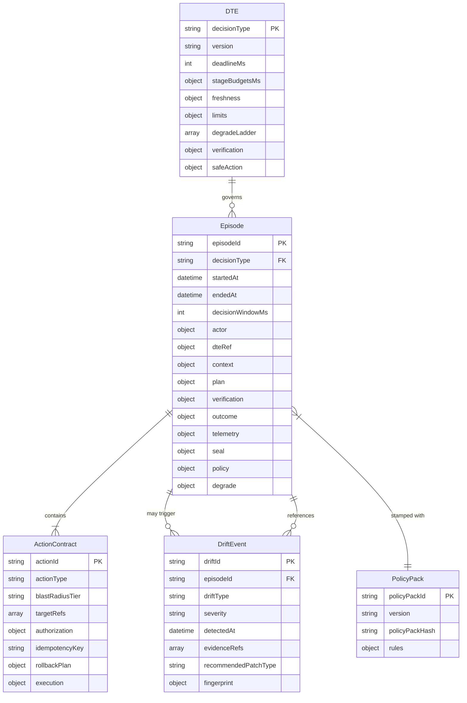

# Schema Relationships

Entity-relationship diagram of the four core JSON schemas in `/specs/`.

```mermaid
erDiagram
    DTE ||--o{ Episode : "governs"
    Episode ||--|{ ActionContract : "contains"
    Episode ||--o{ DriftEvent : "may trigger"
    Episode }|--|| PolicyPack : "stamped with"
    DriftEvent }o--|| Episode : "references"

    DTE {
        string decisionType PK
        string version
        int deadlineMs
        object stageBudgetsMs
        object freshness
        object limits
        array degradeLadder
        object verification
        object safeAction
    }

    Episode {
        string episodeId PK
        string decisionType FK
        datetime startedAt
        datetime endedAt
        int decisionWindowMs
        object actor
        object dteRef
        object context
        object plan
        object verification
        object outcome
        object telemetry
        object seal
        object policy
        object degrade
    }

    ActionContract {
        string actionId PK
        string actionType
        string blastRadiusTier
        array targetRefs
        object authorization
        string idempotencyKey
        object rollbackPlan
        object execution
    }

    DriftEvent {
        string driftId PK
        string episodeId FK
        string driftType
        string severity
        datetime detectedAt
        array evidenceRefs
        string recommendedPatchType
        object fingerprint
    }

    PolicyPack {
        string policyPackId PK
        string version
        string policyPackHash
        object rules
    }
```
