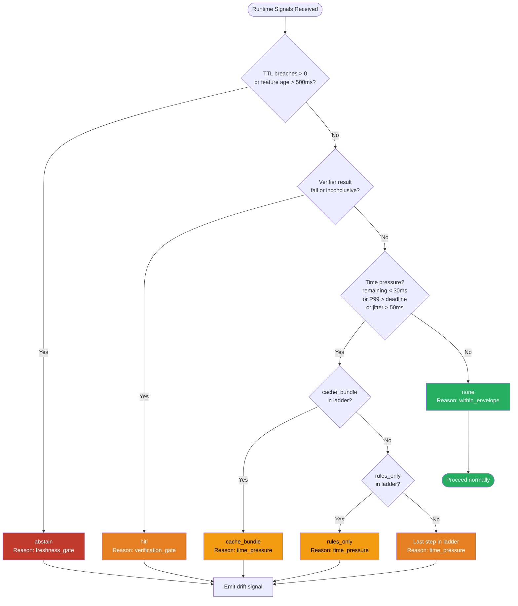
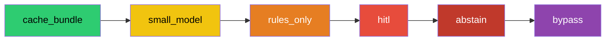

# Degrade Ladder

Decision flowchart for the degrade ladder engine (`engine/degrade_ladder.py`).
Shows how runtime signals determine which fallback step is selected.

```mermaid
flowchart TD
    START([Runtime Signals Received]) --> FRESH{TTL breaches > 0<br/>or feature age > 500ms?}

    FRESH -->|Yes| ABSTAIN[abstain<br/>Reason: freshness_gate]
    FRESH -->|No| VERIFY{Verifier result<br/>fail or inconclusive?}

    VERIFY -->|Yes| HITL[hitl<br/>Reason: verification_gate]
    VERIFY -->|No| TIME{Time pressure?<br/>remaining < 30ms<br/>or P99 > deadline<br/>or jitter > 50ms}

    TIME -->|Yes| CACHE{cache_bundle<br/>in ladder?}
    CACHE -->|Yes| CB[cache_bundle<br/>Reason: time_pressure]
    CACHE -->|No| RULES{rules_only<br/>in ladder?}
    RULES -->|Yes| RO[rules_only<br/>Reason: time_pressure]
    RULES -->|No| LAST[Last step in ladder<br/>Reason: time_pressure]

    TIME -->|No| NONE[none<br/>Reason: within_envelope]

    ABSTAIN --> EMIT[Emit drift signal]
    HITL --> EMIT
    CB --> EMIT
    RO --> EMIT
    LAST --> EMIT
    NONE --> PROCEED([Proceed normally])

    style ABSTAIN fill:#c0392b,color:#fff
    style HITL fill:#e67e22,color:#fff
    style CB fill:#f39c12,color:#000
    style RO fill:#f39c12,color:#000
    style LAST fill:#e67e22,color:#fff
    style NONE fill:#27ae60,color:#fff
    style PROCEED fill:#27ae60,color:#fff
```

## Degrade Steps (ordered)

```mermaid
graph LR
    A[cache_bundle] --> B[small_model] --> C[rules_only] --> D[hitl] --> E[abstain] --> F[bypass]

    style A fill:#2ecc71,color:#000
    style B fill:#f1c40f,color:#000
    style C fill:#e67e22,color:#fff
    style D fill:#e74c3c,color:#fff
    style E fill:#c0392b,color:#fff
    style F fill:#8e44ad,color:#fff
```
