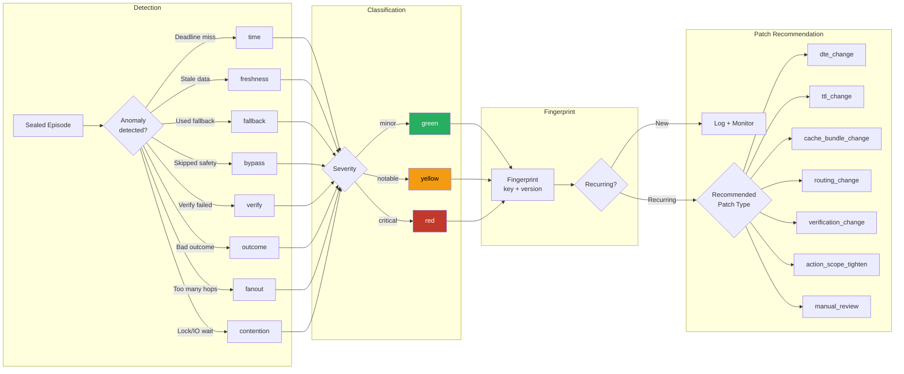
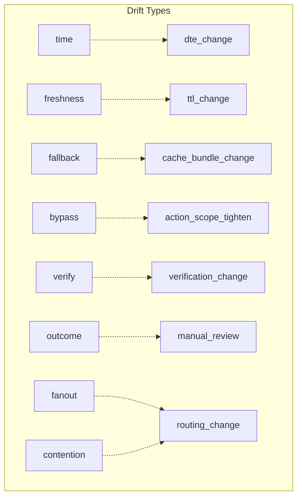

# Drift to Patch Lifecycle

How runtime drift events flow from detection through classification
to patch recommendations and policy updates.

```mermaid
flowchart LR
    subgraph Detection["Detection"]
        EP[Sealed Episode] --> DETECT{Anomaly<br/>detected?}
        DETECT -->|Deadline miss| TIME[time]
        DETECT -->|Stale data| FRESH[freshness]
        DETECT -->|Used fallback| FALL[fallback]
        DETECT -->|Skipped safety| BYP[bypass]
        DETECT -->|Verify failed| VER[verify]
        DETECT -->|Bad outcome| OUT[outcome]
        DETECT -->|Too many hops| FAN[fanout]
        DETECT -->|Lock/IO wait| CON[contention]
    end

    subgraph Classification["Classification"]
        TIME --> SEV{Severity}
        FRESH --> SEV
        FALL --> SEV
        BYP --> SEV
        VER --> SEV
        OUT --> SEV
        FAN --> SEV
        CON --> SEV
        SEV -->|minor| GREEN[green]
        SEV -->|notable| YELLOW[yellow]
        SEV -->|critical| RED[red]
    end

    subgraph Fingerprint["Fingerprint"]
        GREEN --> FP[Fingerprint<br/>key + version]
        YELLOW --> FP
        RED --> FP
        FP --> REC{Recurring?}
    end

    subgraph Patch["Patch Recommendation"]
        REC -->|New| LOG[Log + Monitor]
        REC -->|Recurring| PATCH{Recommended<br/>Patch Type}
        PATCH --> P1[dte_change]
        PATCH --> P2[ttl_change]
        PATCH --> P3[cache_bundle_change]
        PATCH --> P4[routing_change]
        PATCH --> P5[verification_change]
        PATCH --> P6[action_scope_tighten]
        PATCH --> P7[manual_review]
    end

    style GREEN fill:#27ae60,color:#fff
    style YELLOW fill:#f39c12,color:#000
    style RED fill:#c0392b,color:#fff
```

## Drift Types and Patch Mapping

```mermaid
graph TD
    subgraph Types["Drift Types"]
        T1[time] -.-> P1[dte_change]
        T2[freshness] -.-> P2[ttl_change]
        T3[fallback] -.-> P3[cache_bundle_change]
        T4[bypass] -.-> P6[action_scope_tighten]
        T5[verify] -.-> P5[verification_change]
        T6[outcome] -.-> P7[manual_review]
        T7[fanout] -.-> P4[routing_change]
        T8[contention] -.-> P4
    end
```
