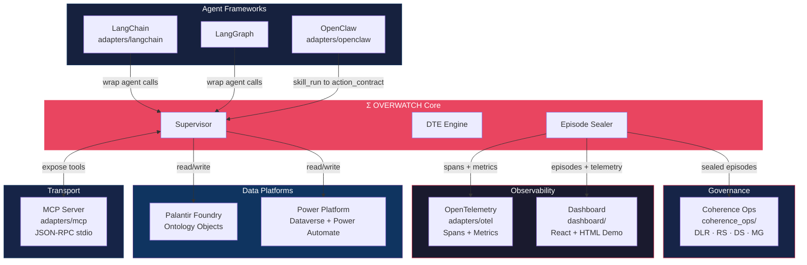
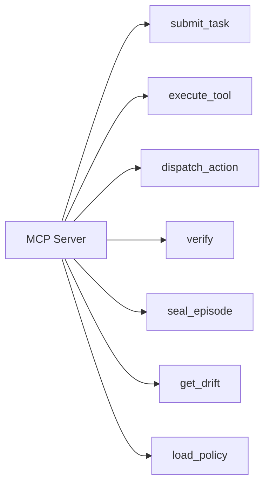

# Integration Map

How Σ OVERWATCH / RAL connects to external frameworks and platforms.

```mermaid
graph TB
    subgraph Core["Σ OVERWATCH Core"]
        SUP[Supervisor]
        DTE[DTE Engine]
        SEAL[Episode Sealer]
    end

    subgraph AgentFrameworks["Agent Frameworks"]
        LC[LangChain<br/>adapters/langchain]
        LG[LangGraph]
        OCLAW[OpenClaw<br/>adapters/openclaw]
    end

    subgraph Transport["Transport"]
        MCPS[MCP Server<br/>adapters/mcp<br/>JSON-RPC stdio]
    end

    subgraph Observability["Observability"]
        OTEL[OpenTelemetry<br/>adapters/otel<br/>Spans + Metrics]
        DASH[Dashboard<br/>dashboard/<br/>React + HTML Demo]
    end

    subgraph DataPlatforms["Data Platforms"]
        FOUNDRY[Palantir Foundry<br/>Ontology Objects]
        POWER[Power Platform<br/>Dataverse + Power Automate]
    end

    subgraph Governance["Governance"]
        COHOPS[Coherence Ops<br/>coherence_ops/<br/>DLR · RS · DS · MG]
    end

    LC -->|wrap agent calls| SUP
    LG -->|wrap agent calls| SUP
    OCLAW -->|skill_run to action_contract| SUP

    SUP <-->|expose tools| MCPS

    SEAL -->|spans + metrics| OTEL
    SEAL -->|episodes + telemetry| DASH

    SUP -->|read/write| FOUNDRY
    SUP -->|read/write| POWER

    SEAL -->|sealed episodes| COHOPS

    style Core fill:#e94560,stroke:#e94560,color:#fff
    style AgentFrameworks fill:#16213e,stroke:#0f3460,color:#fff
    style Transport fill:#162447,stroke:#1f4068,color:#fff
    style Observability fill:#1a1a2e,stroke:#e94560,color:#fff
    style DataPlatforms fill:#0f3460,stroke:#533483,color:#fff
    style Governance fill:#162447,stroke:#e94560,color:#fff
```

## MCP Tool Catalog

```mermaid
graph LR
    MCP[MCP Server] --> T1[submit_task]
    MCP --> T2[execute_tool]
    MCP --> T3[dispatch_action]
    MCP --> T4[verify]
    MCP --> T5[seal_episode]
    MCP --> T6[get_drift]
    MCP --> T7[load_policy]
```
