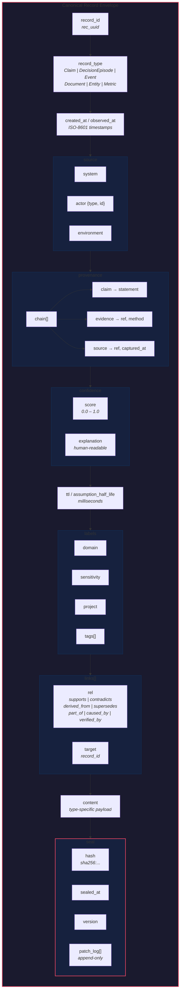

# 11 — Canonical Record Envelope

The structure of the universal record wrapper that every data object carries.

```mermaid
graph TD
    subgraph Envelope["Canonical Record Envelope"]
        direction TB
        RID["record_id<br/><i>rec_uuid</i>"]
        RT["record_type<br/><i>Claim | DecisionEpisode | Event<br/>Document | Entity | Metric</i>"]
        TS["created_at / observed_at<br/><i>ISO-8601 timestamps</i>"]

        subgraph Source["source"]
            SYS["system"]
            ACT["actor {type, id}"]
            ENV["environment"]
        end

        subgraph Provenance["provenance"]
            CHAIN["chain[]"]
            CL["claim → statement"]
            EV["evidence → ref, method"]
            SR["source → ref, captured_at"]
        end

        subgraph Confidence["confidence"]
            SCORE["score<br/><i>0.0 – 1.0</i>"]
            EXPL["explanation<br/><i>human-readable</i>"]
        end

        TTL["ttl / assumption_half_life<br/><i>milliseconds</i>"]

        subgraph Labels["labels"]
            DOM["domain"]
            SENS["sensitivity"]
            PROJ["project"]
            TAGS["tags[]"]
        end

        subgraph Links["links[]"]
            REL["rel<br/><i>supports | contradicts<br/>derived_from | supersedes<br/>part_of | caused_by | verified_by</i>"]
            TGT["target<br/><i>record_id</i>"]
        end

        CONTENT["content<br/><i>type-specific payload</i>"]

        subgraph Seal["seal"]
            HASH["hash<br/><i>sha256:...</i>"]
            SAT["sealed_at"]
            VER["version"]
            PLOG["patch_log[]<br/><i>append-only</i>"]
        end
    end

    RID --> RT --> TS
    TS --> Source
    Source --> Provenance
    Provenance --> Confidence
    Confidence --> TTL
    TTL --> Labels
    Labels --> Links
    Links --> CONTENT
    CONTENT --> Seal

    CHAIN --> CL
    CHAIN --> EV
    CHAIN --> SR

    style Envelope fill:#1a1a2e,stroke:#e94560,stroke-width:2px
    style Source fill:#16213e,stroke:#0f3460
    style Provenance fill:#16213e,stroke:#0f3460
    style Confidence fill:#16213e,stroke:#0f3460
    style Labels fill:#16213e,stroke:#0f3460
    style Links fill:#16213e,stroke:#0f3460
    style Seal fill:#16213e,stroke:#e94560,stroke-width:2px
```
