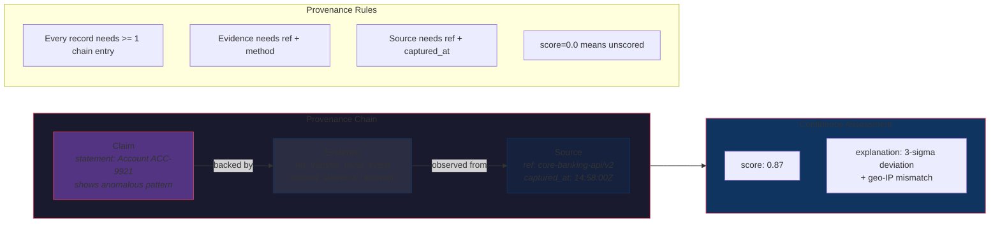
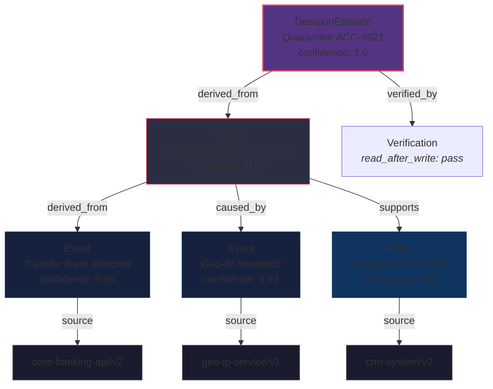

# 13 — Provenance Chain

How the Claim → Evidence → Source chain establishes trust in every record.

```mermaid
flowchart LR
    subgraph Chain["Provenance Chain"]
        direction LR
        C["Claim<br/><i>statement: Account ACC-9921<br/>shows anomalous pattern</i>"]
        E["Evidence<br/><i>ref: transfer_burst_event<br/>method: statistical_anomaly</i>"]
        S["Source<br/><i>ref: core-banking-api/v2<br/>captured_at: 14:58:00Z</i>"]
    end

    C -->|"backed by"| E -->|"observed from"| S

    subgraph Confidence["Confidence Assessment"]
        SC["score: 0.87"]
        EX["explanation: 3-sigma deviation<br/>+ geo-IP mismatch"]
    end

    Chain --> Confidence

    subgraph Rules["Provenance Rules"]
        R1["Every record needs >= 1 chain entry"]
        R2["Evidence needs ref + method"]
        R3["Source needs ref + captured_at"]
        R4["score=0.0 means unscored"]
    end

    style Chain fill:#1a1a2e,stroke:#e94560
    style Confidence fill:#0f3460,stroke:#e94560
    style C fill:#533483,stroke:#e94560
    style E fill:#2b2d42,stroke:#0f3460
    style S fill:#16213e,stroke:#0f3460
```

## Full evidence tree example

```mermaid
flowchart TB
    DEC["DecisionEpisode<br/><i>Quarantine ACC-9921</i><br/>confidence: 1.0"]
    CLM["Claim<br/><i>Anomalous transfer pattern</i><br/>confidence: 0.87"]
    EVT1["Event<br/><i>Transfer burst detected</i><br/>confidence: 0.95"]
    EVT2["Event<br/><i>Geo-IP mismatch</i><br/>confidence: 0.92"]
    ENT["Entity<br/><i>Customer ACC-9921</i><br/>confidence: 0.99"]
    SRC1["core-banking-api/v2"]
    SRC2["geo-ip-service/v1"]
    SRC3["crm-system/v2"]

    DEC -->|"derived_from"| CLM
    CLM -->|"derived_from"| EVT1
    CLM -->|"caused_by"| EVT2
    CLM -->|"supports"| ENT
    EVT1 -->|"source"| SRC1
    EVT2 -->|"source"| SRC2
    ENT -->|"source"| SRC3
    DEC -->|"verified_by"| VER["Verification<br/><i>read_after_write: pass</i>"]

    style DEC fill:#533483,stroke:#e94560,stroke-width:2px
    style CLM fill:#2b2d42,stroke:#e94560
    style EVT1 fill:#16213e,stroke:#0f3460
    style EVT2 fill:#16213e,stroke:#0f3460
    style ENT fill:#0f3460,stroke:#0f3460
    style SRC1 fill:#1a1a2e,stroke:#555
    style SRC2 fill:#1a1a2e,stroke:#555
    style SRC3 fill:#1a1a2e,stroke:#555
```
