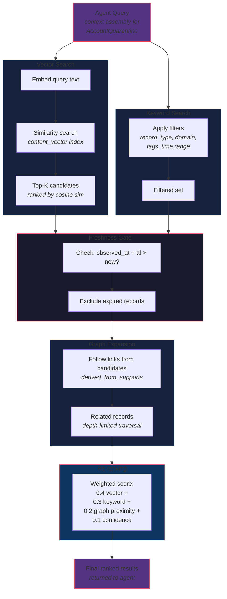
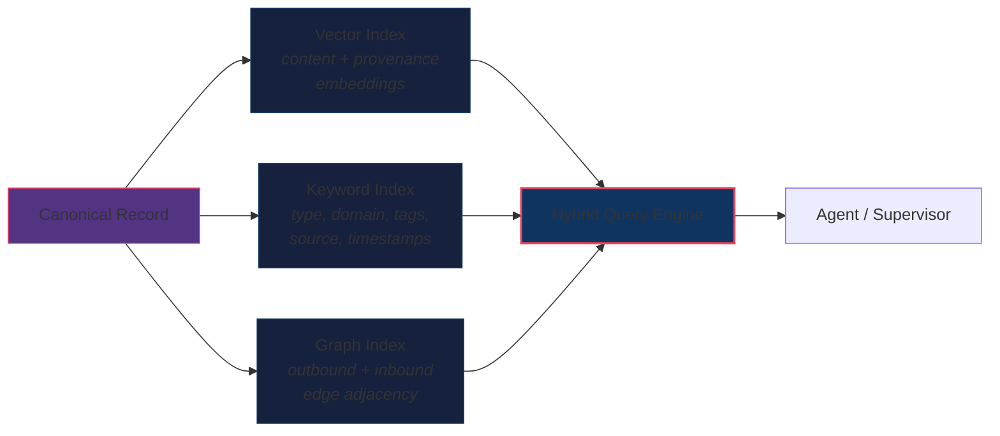

# 15 — Retrieval Pipeline

How vector, keyword, and graph retrieval work together in a hybrid query.

```mermaid
flowchart TB
    QUERY["Agent Query<br/><i>context assembly for<br/>AccountQuarantine</i>"]

    subgraph Vector["Vector Search"]
        VE["Embed query text"]
        VS["Similarity search<br/><i>content_vector index</i>"]
        VR["Top-K candidates<br/><i>ranked by cosine sim</i>"]
    end

    subgraph Keyword["Keyword Search"]
        KF["Apply filters<br/><i>record_type, domain,<br/>tags, time range</i>"]
        KR["Filtered set"]
    end

    subgraph Freshness["Freshness Gate"]
        FG["Check: observed_at + ttl > now?"]
        FR["Exclude expired records"]
    end

    subgraph Graph["Graph Expansion"]
        GE["Follow links from candidates<br/><i>derived_from, supports</i>"]
        GR["Related records<br/><i>depth-limited traversal</i>"]
    end

    subgraph Rerank["Re-ranking"]
        RK["Weighted score:<br/>0.4 vector +<br/>0.3 keyword +<br/>0.2 graph proximity +<br/>0.1 confidence"]
    end

    QUERY --> Vector
    QUERY --> Keyword
    VE --> VS --> VR
    KF --> KR
    VR --> Freshness
    KR --> Freshness
    FG --> FR
    FR --> Graph
    GE --> GR
    GR --> Rerank
    RK --> RESULT["Final ranked results<br/><i>returned to agent</i>"]

    style QUERY fill:#533483,stroke:#e94560,stroke-width:2px
    style Vector fill:#16213e,stroke:#0f3460
    style Keyword fill:#16213e,stroke:#0f3460
    style Freshness fill:#1a1a2e,stroke:#e94560
    style Graph fill:#16213e,stroke:#0f3460
    style Rerank fill:#0f3460,stroke:#e94560
    style RESULT fill:#533483,stroke:#e94560,stroke-width:2px
```

## Index architecture

```mermaid
graph LR
    REC["Canonical Record"] --> VI["Vector Index<br/><i>content + provenance<br/>embeddings</i>"]
    REC --> KI["Keyword Index<br/><i>type, domain, tags,<br/>source, timestamps</i>"]
    REC --> GI["Graph Index<br/><i>outbound + inbound<br/>edge adjacency</i>"]

    VI --> HQ["Hybrid Query Engine"]
    KI --> HQ
    GI --> HQ
    HQ --> AGT["Agent / Supervisor"]

    style REC fill:#533483,stroke:#e94560
    style VI fill:#16213e,stroke:#0f3460
    style KI fill:#16213e,stroke:#0f3460
    style GI fill:#16213e,stroke:#0f3460
    style HQ fill:#0f3460,stroke:#e94560,stroke-width:2px
```
