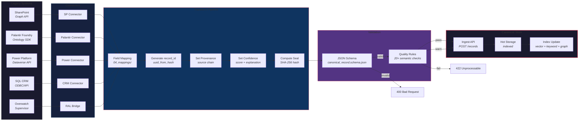

# 16 — Ingestion Flow

How records flow from legacy systems through connectors into the canonical store.

```mermaid
flowchart LR
    subgraph Sources["Legacy Systems"]
        SP["SharePoint<br/><i>Graph API</i>"]
        PF["Palantir Foundry<br/><i>Ontology SDK</i>"]
        PP["Power Platform<br/><i>Dataverse API</i>"]
        CRM["SQL CRM<br/><i>ODBC/API</i>"]
        OW["Overwatch<br/><i>Supervisor</i>"]
    end

    subgraph Connectors["Connectors"]
        SPC["SP Connector"]
        PFC["Palantir Connector"]
        PPC["Power Connector"]
        CRMC["CRM Connector"]
        OWC["RAL Bridge"]
    end

    subgraph Transform["Transform Pipeline"]
        MAP["Field Mapping<br/><i>04_mappings/</i>"]
        UUID["Generate record_id<br/><i>uuid_from_hash</i>"]
        PROV["Set Provenance<br/><i>source chain</i>"]
        CONF["Set Confidence<br/><i>score + explanation</i>"]
        SEAL["Compute Seal<br/><i>SHA-256 hash</i>"]
    end

    subgraph Validate["Validation"]
        SCHEMA["JSON Schema<br/><i>canonical_record.schema.json</i>"]
        QR["Quality Rules<br/><i>20+ semantic checks</i>"]
    end

    subgraph Store["Canonical Store"]
        API["Ingest API<br/><i>POST /records</i>"]
        HOT["Hot Storage<br/><i>indexed</i>"]
        IDX["Index Update<br/><i>vector + keyword + graph</i>"]
    end

    SP --> SPC --> MAP
    PF --> PFC --> MAP
    PP --> PPC --> MAP
    CRM --> CRMC --> MAP
    OW --> OWC --> MAP

    MAP --> UUID --> PROV --> CONF --> SEAL
    SEAL --> SCHEMA
    SCHEMA -->|valid| QR
    SCHEMA -->|invalid| REJ["400 Bad Request"]
    QR -->|pass| API
    QR -->|warn| API
    QR -->|fail| REJ2["422 Unprocessable"]
    API --> HOT --> IDX

    style Sources fill:#1a1a2e,stroke:#555
    style Connectors fill:#16213e,stroke:#0f3460
    style Transform fill:#0f3460,stroke:#e94560
    style Validate fill:#533483,stroke:#e94560
    style Store fill:#1a1a2e,stroke:#e94560,stroke-width:2px
```
