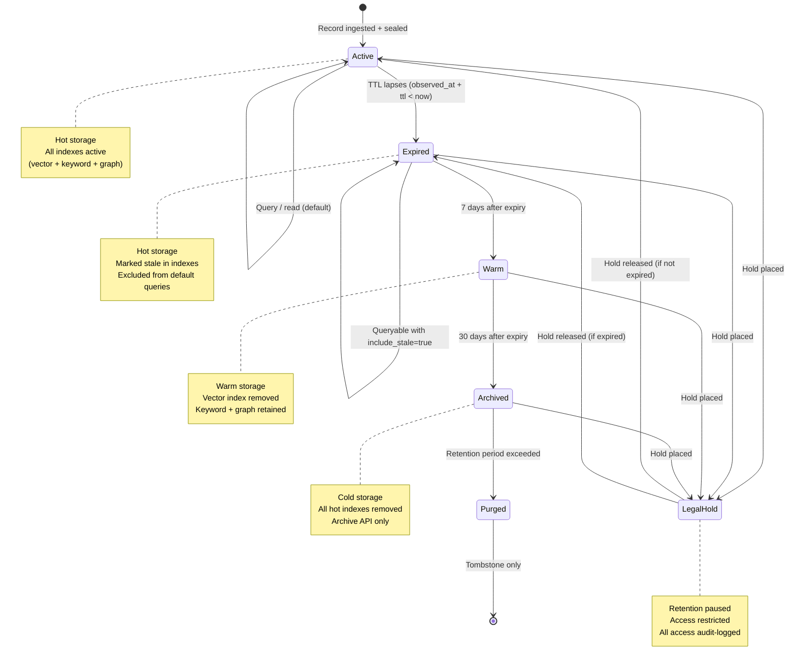

# 17 — Data Lifecycle

How records move through retention stages from ingestion to purging.

```mermaid
stateDiagram-v2
    [*] --> Active: Record ingested + sealed
    Active --> Active: Query / read (default)
    Active --> Expired: TTL lapses (observed_at + ttl < now)
    Active --> LegalHold: Hold placed

    Expired --> Expired: Queryable with include_stale=true
    Expired --> Warm: 7 days after expiry
    Expired --> LegalHold: Hold placed

    Warm --> Archived: 30 days after expiry
    Warm --> LegalHold: Hold placed

    Archived --> Purged: Retention period exceeded
    Archived --> LegalHold: Hold placed

    LegalHold --> Active: Hold released (if not expired)
    LegalHold --> Expired: Hold released (if expired)

    Purged --> [*]: Tombstone only

    note right of Active
        Hot storage
        All indexes active
        (vector + keyword + graph)
    end note

    note right of Expired
        Hot storage
        Marked stale in indexes
        Excluded from default queries
    end note

    note right of Warm
        Warm storage
        Vector index removed
        Keyword + graph retained
    end note

    note right of Archived
        Cold storage
        All hot indexes removed
        Archive API only
    end note

    note right of LegalHold
        Retention paused
        Access restricted
        All access audit-logged
    end note
```

## Retention by record type

```mermaid
gantt
    title Record Retention Timeline
    dateFormat X
    axisFormat %s

    section Perpetual
    DecisionEpisode (sealed)     :done, 0, 365
    Policy Document (ttl=0)      :done, 0, 365

    section Standard
    Claim (active TTL)           :active, 0, 1
    Claim (expired)              :crit, 1, 8
    Claim (warm)                 :8, 38
    Claim (archived)             :38, 365

    section Operational
    Flow Run (7d active)         :active, 0, 7
    Flow Run (warm)              :7, 37
    Flow Run (archived)          :37, 97

    section Ephemeral
    Cache entry (TTL only)       :active, 0, 1
```
