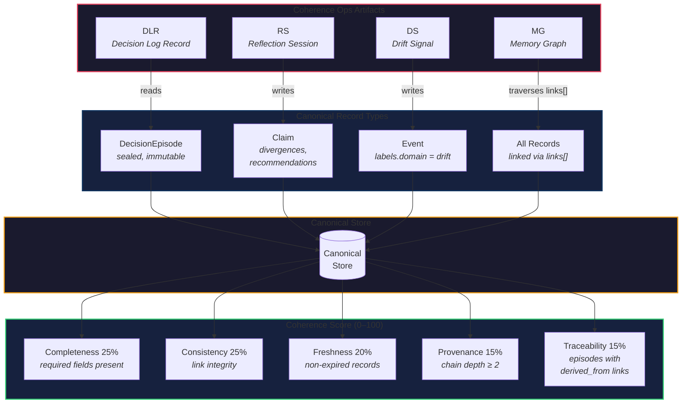

# 21 — Coherence Ops Alignment

How the four Coherence Ops artifacts (DLR, RS, DS, MG) map to canonical record types, and how the scoring dimensions draw from the data model.

```mermaid
graph TD
    subgraph CohOps["Coherence Ops Artifacts"]
        DLR["DLR<br/><i>Decision Log Record</i>"]
        RS["RS<br/><i>Reflection Session</i>"]
        DS["DS<br/><i>Drift Signal</i>"]
        MG["MG<br/><i>Memory Graph</i>"]
    end

    subgraph Records["Canonical Record Types"]
        DE["DecisionEpisode<br/><i>sealed, immutable</i>"]
        CL["Claim<br/><i>divergences,<br/>recommendations</i>"]
        EV["Event<br/><i>labels.domain = drift</i>"]
        ALL["All Records<br/><i>linked via links[]</i>"]
    end

    subgraph Store["Canonical Store"]
        CS[("Canonical<br/>Store")]
    end

    subgraph Scoring["Coherence Score (0–100)"]
        S1["Completeness 25%<br/><i>required fields present</i>"]
        S2["Consistency 25%<br/><i>link integrity</i>"]
        S3["Freshness 20%<br/><i>non-expired records</i>"]
        S4["Provenance 15%<br/><i>chain depth ≥ 2</i>"]
        S5["Traceability 15%<br/><i>episodes with<br/>derived_from links</i>"]
    end

    DLR -->|"reads"| DE
    RS -->|"writes"| CL
    DS -->|"writes"| EV
    MG -->|"traverses links[]"| ALL

    DE --> CS
    CL --> CS
    EV --> CS
    ALL --> CS

    CS --> S1
    CS --> S2
    CS --> S3
    CS --> S4
    CS --> S5

    style CohOps fill:#1a1a2e,stroke:#e94560,stroke-width:2px
    style Records fill:#16213e,stroke:#0f3460,stroke-width:2px
    style Store fill:#1a1a2e,stroke:#f39c12,stroke-width:2px
    style Scoring fill:#16213e,stroke:#2ecc71,stroke-width:2px
```
