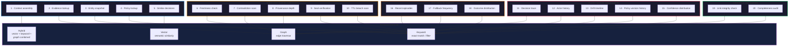

# 22 — Query Pattern Routing

The 20 canonical query patterns grouped by caller role, showing which retrieval method each uses. Based on `07_retrieval/query_patterns.md`.

```mermaid
graph TD
    subgraph Agent["Agent Queries (runtime)"]
        A1["1 · Context assembly"]
        A2["2 · Evidence lookup"]
        A3["3 · Entity snapshot"]
        A4["4 · Policy lookup"]
        A5["5 · Similar decisions"]
    end

    subgraph Supervisor["Supervisor Queries (validation)"]
        S6["6 · Freshness check"]
        S7["7 · Contradiction scan"]
        S8["8 · Provenance depth"]
        S9["9 · Seal verification"]
        S10["10 · TTL breach scan"]
    end

    subgraph Auditor["Auditor Queries (governance)"]
        AU11["11 · Decision trace"]
        AU12["12 · Actor history"]
        AU13["13 · Drift timeline"]
        AU14["14 · Policy version history"]
        AU15["15 · Confidence distribution"]
    end

    subgraph Drift["Drift Detector Queries"]
        D16["16 · Recent episodes"]
        D17["17 · Fallback frequency"]
        D18["18 · Outcome distribution"]
    end

    subgraph CohOps["Coherence Ops Queries"]
        C19["19 · Link integrity check"]
        C20["20 · Completeness audit"]
    end

    subgraph Methods["Retrieval Methods"]
        VEC["Vector<br/><i>semantic similarity</i>"]
        KW["Keyword<br/><i>exact match / filter</i>"]
        GR["Graph<br/><i>edge traversal</i>"]
        HY["Hybrid<br/><i>vector + keyword +<br/>graph combined</i>"]
    end

    A1 --> HY
    A2 --> GR
    A3 --> KW
    A4 --> KW
    A5 --> VEC
    S6 --> KW
    S7 --> GR
    S8 --> GR
    S9 --> KW
    S10 --> KW
    AU11 --> GR
    AU12 --> KW
    AU13 --> KW
    AU14 --> GR
    AU15 --> KW
    D16 --> KW
    D17 --> KW
    D18 --> KW
    C19 --> GR
    C20 --> KW

    style Agent fill:#1a1a2e,stroke:#3498db,stroke-width:2px
    style Supervisor fill:#1a1a2e,stroke:#f39c12,stroke-width:2px
    style Auditor fill:#1a1a2e,stroke:#e94560,stroke-width:2px
    style Drift fill:#1a1a2e,stroke:#e67e22,stroke-width:2px
    style CohOps fill:#1a1a2e,stroke:#2ecc71,stroke-width:2px
    style Methods fill:#16213e,stroke:#9b59b6,stroke-width:2px
```
