# 25 — SharePoint → RDF Extraction Pipeline

> Source: `rdf/pipelines/extractor_design.md`, `rdf/pipelines/sharepoint_connector_contract.md`

```mermaid
flowchart LR
  subgraph source["Source System"]
    style source fill:#1a1a2e,stroke:#0f3460,color:#e0e0e0
    SP[SharePoint<br/>Docs + Metadata]
  end

  subgraph extract["Extract"]
    style extract fill:#16213e,stroke:#0f3460,color:#e0e0e0
    CONN[SP Connector<br/>Graph API / CSOM]
    EXT[Extractor<br/>Deterministic + LLM]
  end

  subgraph normalize["Normalize"]
    style normalize fill:#16213e,stroke:#533483,color:#e0e0e0
    CID[Canonical IDs<br/>DEC_ CL_ EV_ SRC_]
    DEDUP[De-duplicate<br/>Hash + Similarity]
  end

  subgraph emit["Emit"]
    style emit fill:#1a1a2e,stroke:#533483,color:#e0e0e0
    TTL[Turtle Triples<br/>.ttl]
    CSV[CSV Audit Log]
  end

  subgraph validate["Validate"]
    style validate fill:#533483,stroke:#e94560,color:#e0e0e0
    SHACL[SHACL<br/>Constitution Layer]
  end

  subgraph serve["Serve"]
    style serve fill:#0f3460,stroke:#00ff88,color:#e0e0e0
    SPARQL[SPARQL<br/>Executive Queries]
    LLM[LLM<br/>Subgraph Context]
  end

  SP --> CONN --> EXT
  EXT --> CID --> DEDUP
  DEDUP --> TTL
  DEDUP --> CSV
  TTL --> SHACL
  SHACL -->|conform| SPARQL
  SHACL -->|conform| LLM
  SHACL -->|fail| EXT

  style SP fill:#0f3460,stroke:#e94560,color:#fff
  style CONN fill:#0f3460,stroke:#e94560,color:#fff
  style EXT fill:#533483,stroke:#e94560,color:#fff
  style CID fill:#533483,stroke:#0f3460,color:#fff
  style DEDUP fill:#533483,stroke:#0f3460,color:#fff
  style TTL fill:#0f3460,stroke:#00ff88,color:#fff
  style CSV fill:#16213e,stroke:#0f3460,color:#e0e0e0
  style SHACL fill:#e94560,stroke:#fff,color:#fff
  style SPARQL fill:#0f3460,stroke:#00ff88,color:#fff
  style LLM fill:#0f3460,stroke:#00ff88,color:#fff
```

## Reading the Diagram

| Stage | What Happens |
|-------|-------------|
| Source | SharePoint items read via Graph API or CSOM |
| Extract | Deterministic extraction preferred; LLM for classification only |
| Normalize | Canonical IDs assigned; content-hash + semantic de-duplication |
| Emit | Turtle triples (.ttl) plus optional CSV audit trail |
| Validate | SHACL shapes enforce constitution; failures loop back |
| Serve | SPARQL queries for executives; subgraph packing for LLM grounding |

## See Also

- [rdf/pipelines/extractor_design.md](../rdf/pipelines/extractor_design.md)
- [rdf/pipelines/sharepoint_connector_contract.md](../rdf/pipelines/sharepoint_connector_contract.md)
- [24 — SHACL Validation Gate](24-shacl-validation-gate.md)
- [16 — Ingestion Flow](16-ingestion-flow.md)
