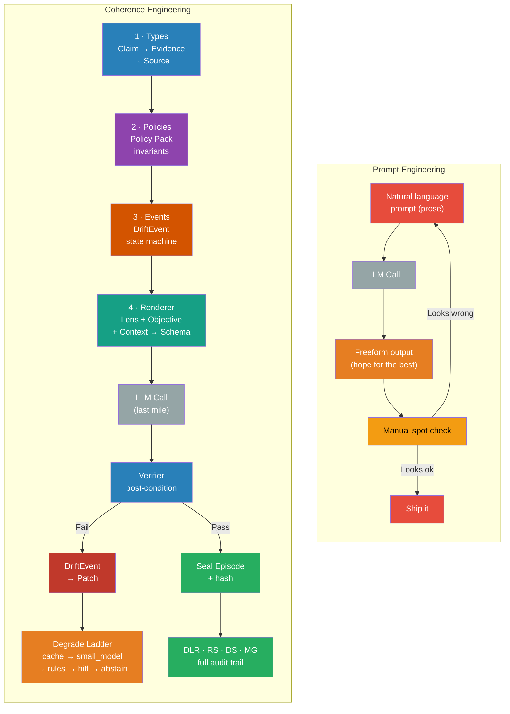
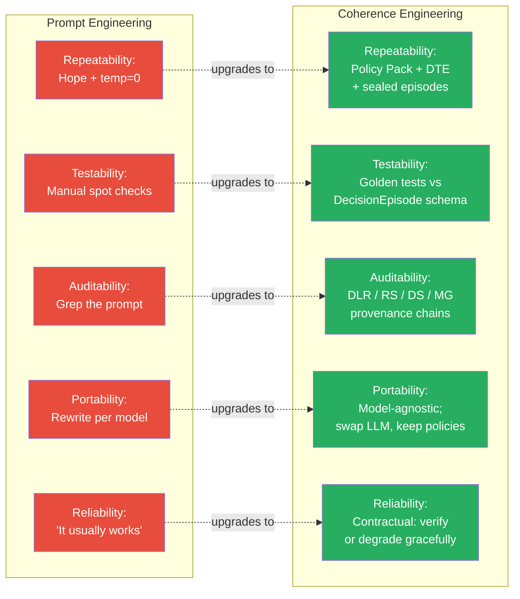

# Prompt Engineering vs Coherence Engineering

Side-by-side comparison of the two paradigms and how Coherence Ops subsumes prompt engineering.

```mermaid
flowchart TB
  subgraph PE["Prompt Engineering"]
    direction TB
    PE_IN["Natural language<br/>prompt (prose)"] --> PE_LLM["LLM Call"]
    PE_LLM --> PE_OUT["Freeform output<br/>(hope for the best)"]
    PE_OUT --> PE_CHECK["Manual spot check"]
    PE_CHECK -->|"Looks wrong"| PE_IN
    PE_CHECK -->|"Looks ok"| PE_SHIP["Ship it"]

    style PE_IN fill:#e74c3c,color:#fff
    style PE_LLM fill:#95a5a6,color:#fff
    style PE_OUT fill:#e67e22,color:#fff
    style PE_CHECK fill:#f39c12,color:#000
    style PE_SHIP fill:#e74c3c,color:#fff
  end

  subgraph CE["Coherence Engineering"]
    direction TB
    CE_TYPES["1 · Types<br/>Claim → Evidence<br/>→ Source"] --> CE_POLICY["2 · Policies<br/>Policy Pack<br/>invariants"]
    CE_POLICY --> CE_EVENTS["3 · Events<br/>DriftEvent<br/>state machine"]
    CE_EVENTS --> CE_RENDER["4 · Renderer<br/>Lens + Objective<br/>+ Context → Schema"]
    CE_RENDER --> CE_LLM["LLM Call<br/>(last mile)"]
    CE_LLM --> CE_VERIFY["Verifier<br/>post-condition"]
    CE_VERIFY -->|Pass| CE_SEAL["Seal Episode<br/>+ hash"]
    CE_VERIFY -->|Fail| CE_DRIFT["DriftEvent<br/>→ Patch"]
    CE_DRIFT --> CE_DEGRADE["Degrade Ladder<br/>cache → small_model<br/>→ rules → hitl → abstain"]
    CE_SEAL --> CE_ARTIFACTS["DLR · RS · DS · MG<br/>full audit trail"]

    style CE_TYPES fill:#2980b9,color:#fff
    style CE_POLICY fill:#8e44ad,color:#fff
    style CE_EVENTS fill:#d35400,color:#fff
    style CE_RENDER fill:#16a085,color:#fff
    style CE_LLM fill:#95a5a6,color:#fff
    style CE_VERIFY fill:#2980b9,color:#fff
    style CE_SEAL fill:#27ae60,color:#fff
    style CE_DRIFT fill:#c0392b,color:#fff
    style CE_DEGRADE fill:#e67e22,color:#fff
    style CE_ARTIFACTS fill:#27ae60,color:#fff
  end
```

## Capability Comparison

```mermaid
graph LR
  subgraph Prompt["Prompt Engineering"]
    P_REP["Repeatability:<br/>Hope + temp=0"]
    P_TEST["Testability:<br/>Manual spot checks"]
    P_AUDIT["Auditability:<br/>Grep the prompt"]
    P_PORT["Portability:<br/>Rewrite per model"]
    P_REL["Reliability:<br/>'It usually works'"]
  end

  subgraph Coherence["Coherence Engineering"]
    C_REP["Repeatability:<br/>Policy Pack + DTE<br/>+ sealed episodes"]
    C_TEST["Testability:<br/>Golden tests vs<br/>DecisionEpisode schema"]
    C_AUDIT["Auditability:<br/>DLR / RS / DS / MG<br/>provenance chains"]
    C_PORT["Portability:<br/>Model-agnostic;<br/>swap LLM, keep policies"]
    C_REL["Reliability:<br/>Contractual: verify<br/>or degrade gracefully"]
  end

  P_REP -.->|"upgrades to"| C_REP
  P_TEST -.->|"upgrades to"| C_TEST
  P_AUDIT -.->|"upgrades to"| C_AUDIT
  P_PORT -.->|"upgrades to"| C_PORT
  P_REL -.->|"upgrades to"| C_REL

  style P_REP fill:#e74c3c,color:#fff
  style P_TEST fill:#e74c3c,color:#fff
  style P_AUDIT fill:#e74c3c,color:#fff
  style P_PORT fill:#e74c3c,color:#fff
  style P_REL fill:#e74c3c,color:#fff
  style C_REP fill:#27ae60,color:#fff
  style C_TEST fill:#27ae60,color:#fff
  style C_AUDIT fill:#27ae60,color:#fff
  style C_PORT fill:#27ae60,color:#fff
  style C_REL fill:#27ae60,color:#fff
```
