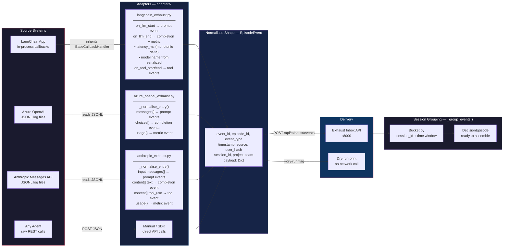
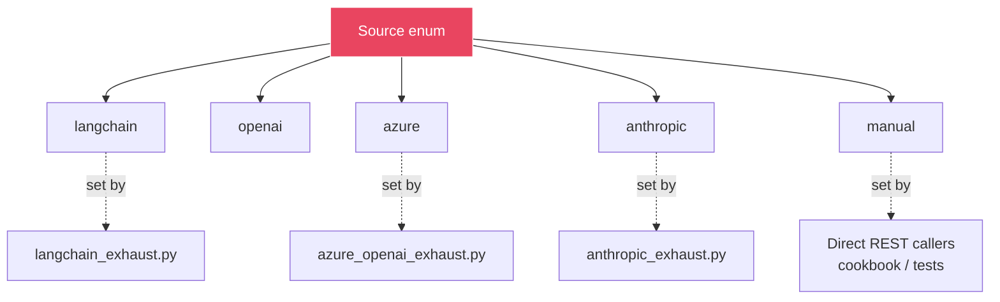
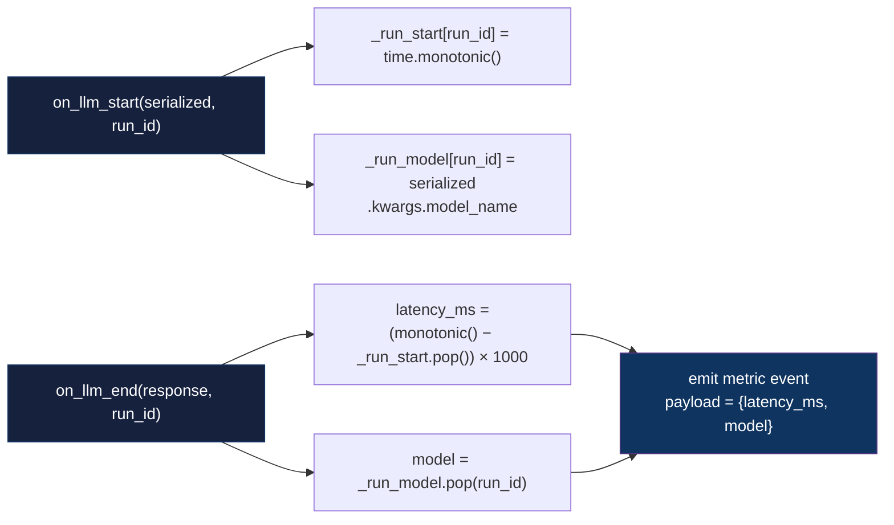

# Exhaust Connector Map

How the three adapter types normalise raw AI interaction logs into EpisodeEvents and deliver them to the Exhaust Inbox.

## Source Enum — Adapter Identity

Each adapter stamps a `source` field so downstream analysis can distinguish origin.

## Metric Enrichment — LangChain Adapter (Build 29)

Targeted additions to `langchain_exhaust.py` that add observability fields to every LLM call.

