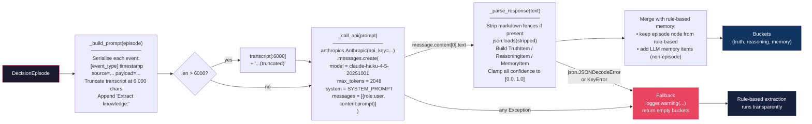
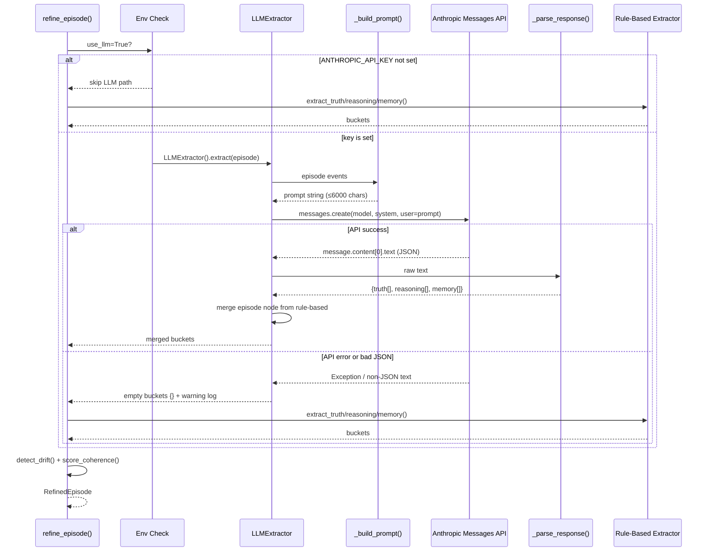

# LLM Extraction Flow

Internal mechanics of `LLMExtractor` — how an episode becomes structured TRUTH / REASONING / MEMORY buckets via the Anthropic Messages API, with full fallback handling.



## API Call Sequence

End-to-end from `refine_episode()` caller through Anthropic and back.



## Confidence Clamping

Ensures LLM-returned confidence values are always valid regardless of model output.

```mermaid
flowchart TD
    RAW["LLM returns confidence\ne.g. 1.5 / -0.2 / 'high' / null"] --> TRY{float(v)?}
    TRY -->|success| CLAMP["max(0.0, min(1.0, v))"]
    TRY -->|ValueError / TypeError| DEF["default = 0.5"]
    CLAMP --> OUT2[Valid confidence 0.0–1.0]
    DEF --> OUT2

    style RAW fill:#1a1a2e,stroke:#e94560,color:#fff
    style OUT2 fill:#0f3460,stroke:#533483,color:#fff
```

## System Prompt

The instruction sent as the `system` parameter on every API call.

```
You are an institutional knowledge extractor for Σ OVERWATCH.
Given an AI decision episode transcript, extract structured knowledge.
Return ONLY valid JSON matching the schema below.
No explanation, no markdown fences.

{
  "truth": [{"claim": str, "confidence": float, "evidence": str}],
  "reasoning": [{"decision": str, "confidence": float, "rationale": str}],
  "memory": [{"entity": str, "entity_type": str, "relations": [str], "confidence": float}]
}
```
