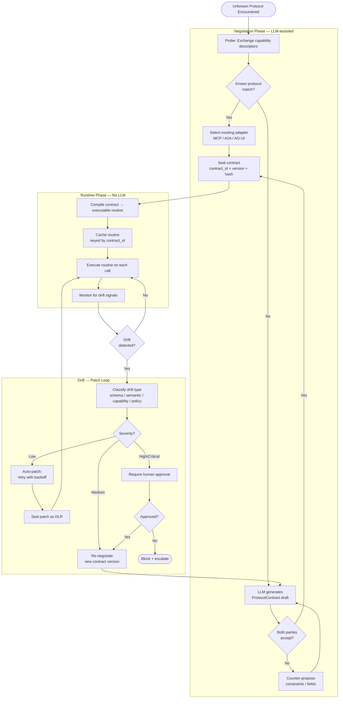

# Agora Negotiation Flow — Unknown Protocol → Sealed Contract → Runtime

How two parties with incompatible protocols converge on a shared contract through LLM-assisted negotiation, then execute without further LLM calls.

