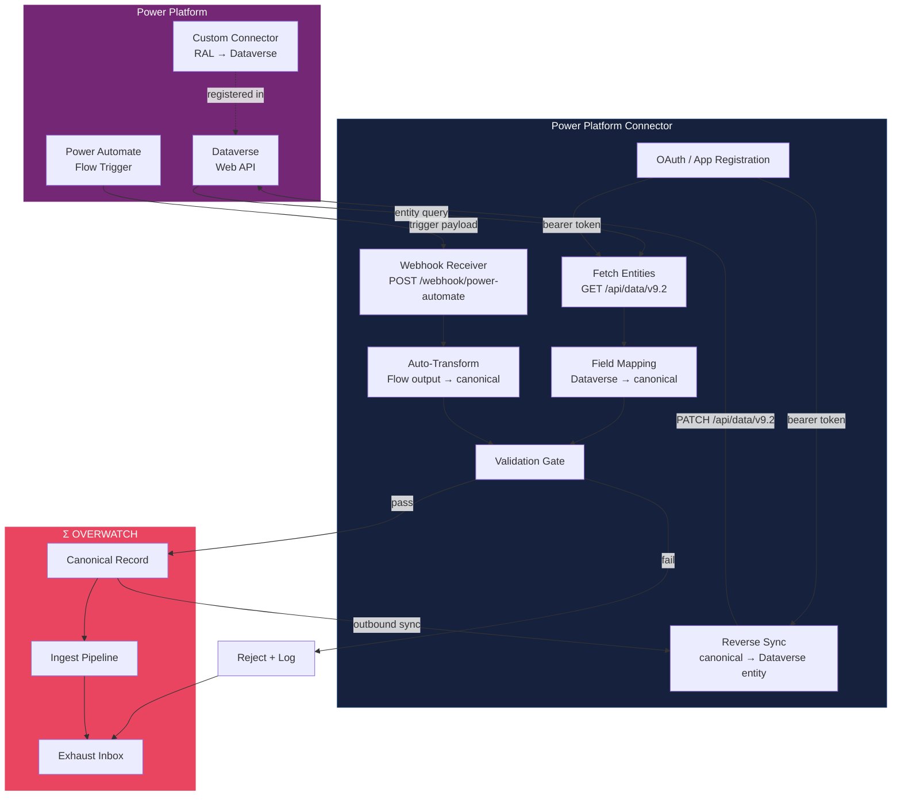

# Power Platform Connector Flow

Data flow between Power Platform (Dataverse, Power Automate) and the RAL canonical store.

## Key Details

- **Dataverse Web API**: Standard OData v4 endpoint for CRUD on entities. The connector maps Dataverse entity fields to canonical record fields.
- **Power Automate Trigger**: Flows can POST payloads to the connector's webhook, enabling event-driven ingestion (e.g., on record create/update).
- **Custom Connector (Reverse Flow)**: A Power Platform custom connector allows Dataverse and Power Apps to call back into RAL, writing canonical records into Dataverse entities.
- **Validation Gate**: Same QR rule engine as all other connectors.
