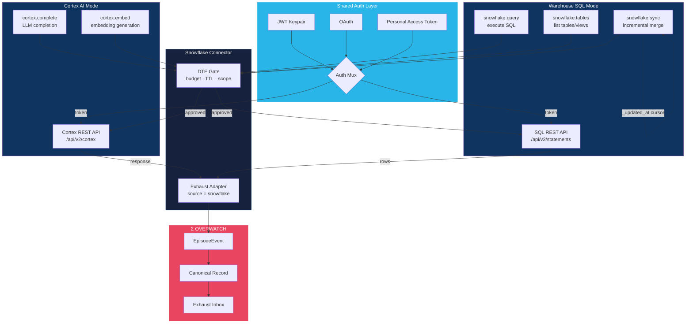

# Snowflake Connector Flow

Dual-mode connector: Cortex AI (LLM completions + embeddings) and warehouse SQL (query + sync), sharing a unified auth layer.

## Key Details

- **Shared Auth Layer**: All three auth methods (JWT keypair, OAuth, PAT) funnel through a single mux. The connector selects the method based on config.
- **Cortex AI Mode**: REST calls to `/api/v2/cortex` for `complete` and `embed`. DTE-gated on token budget and model allowlist.
- **Warehouse SQL Mode**: REST calls to `/api/v2/statements` for arbitrary SQL. `sync` uses an `_updated_at` watermark column for incremental merge.
- **Exhaust Adapter**: Captures `mode` (cortex/warehouse), `operation`, `latency_ms`, `rows_affected`, `token_count`, `cost_usd`.
