# Connector Ecosystem

Updated integration map showing all v0.5.0 connectors with MCP tool counts, transport protocols, and the shared governance layer.

```mermaid
graph TB
    subgraph Core["Σ OVERWATCH Core"]
        SUP[Supervisor]
        DTE[DTE Engine]
        SEAL[Episode Sealer]
        EXHAUST[Exhaust Inbox]
    end

    subgraph Governance["Governance Layer"]
        COHOPS[Coherence Ops<br/>DLR · RS · DS · MG]
        GOV_CB[GovernanceCallbackHandler<br/>raise / log / degrade]
        DTE_TRACK[LangGraph DTETracker]
    end

    subgraph AgentFrameworks["Agent Frameworks"]
        LC[LangChain<br/>callbacks<br/>-- MCP tools]
        LG[LangGraph<br/>state middleware<br/>-- MCP tools]
        OCLAW[OpenClaw<br/>skill_run adapter<br/>-- MCP tools]
    end

    subgraph DataPlatforms["Data Platforms"]
        SAGE[AskSage<br/>HTTPS REST<br/>4 MCP tools]
        SNOW[Snowflake<br/>HTTPS REST + SQL<br/>5 MCP tools]
        FOUNDRY[Palantir Foundry<br/>HTTPS REST<br/>-- MCP tools]
    end

    subgraph Microsoft["Microsoft Ecosystem"]
        SP[SharePoint<br/>Graph API<br/>delta sync + webhooks]
        POWER[Power Platform<br/>Dataverse Web API<br/>Power Automate triggers]
    end

    subgraph Transport["Transport & Observability"]
        MCPS[MCP Server<br/>JSON-RPC stdio<br/>7 MCP tools]
        OTEL[OpenTelemetry<br/>gRPC / HTTP<br/>spans + metrics]
    end

    %% Agent framework connections
    LC -->|wrap calls| SUP
    LG -->|wrap calls| SUP
    OCLAW -->|skill_run| SUP

    %% Governance
    LC --> GOV_CB
    LG --> DTE_TRACK
    GOV_CB --> DTE
    DTE_TRACK --> DTE
    SEAL --> COHOPS

    %% Data platform connections
    SAGE -->|query / train| SUP
    SNOW -->|complete / query| SUP
    FOUNDRY -->|read / write| SUP

    %% Microsoft connections
    SP -->|ingest| SUP
    POWER -->|ingest + reverse sync| SUP

    %% Transport
    SUP <-->|expose tools| MCPS
    SEAL -->|spans + metrics| OTEL

    %% Exhaust
    SUP --> EXHAUST
    SAGE --> EXHAUST
    SNOW --> EXHAUST
    SP --> EXHAUST
    POWER --> EXHAUST

    style Core fill:#e94560,stroke:#e94560,color:#fff
    style Governance fill:#162447,stroke:#e94560,color:#fff
    style AgentFrameworks fill:#16213e,stroke:#0f3460,color:#fff
    style DataPlatforms fill:#0f3460,stroke:#533483,color:#fff
    style Microsoft fill:#0078d4,stroke:#0078d4,color:#fff
    style Transport fill:#1a1a2e,stroke:#e94560,color:#fff
```

## Connector Summary

| Connector | Transport | MCP Tools | Auth | Governance |
|-----------|-----------|-----------|------|------------|
| MCP Server | JSON-RPC stdio | 7 | N/A (local) | DTE built-in |
| LangChain | Python callbacks | -- | N/A (in-process) | GovernanceCallbackHandler |
| LangGraph | Python middleware | -- | N/A (in-process) | DTETracker |
| OpenClaw | Python adapter | -- | N/A (in-process) | DTE via Supervisor |
| AskSage | HTTPS REST | 4 | API Key + 24h Token | DTE Gate |
| Snowflake | HTTPS REST + SQL | 5 | JWT / OAuth / PAT | DTE Gate |
| Palantir Foundry | HTTPS REST | -- | OAuth | DTE via Supervisor |
| SharePoint | Graph API | -- | OAuth App Reg | Validation Gate |
| Power Platform | Dataverse Web API | -- | OAuth App Reg | Validation Gate |
| OpenTelemetry | gRPC / HTTP | -- | N/A | Span-level |
