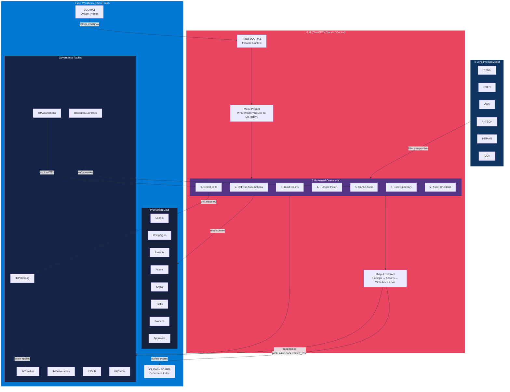
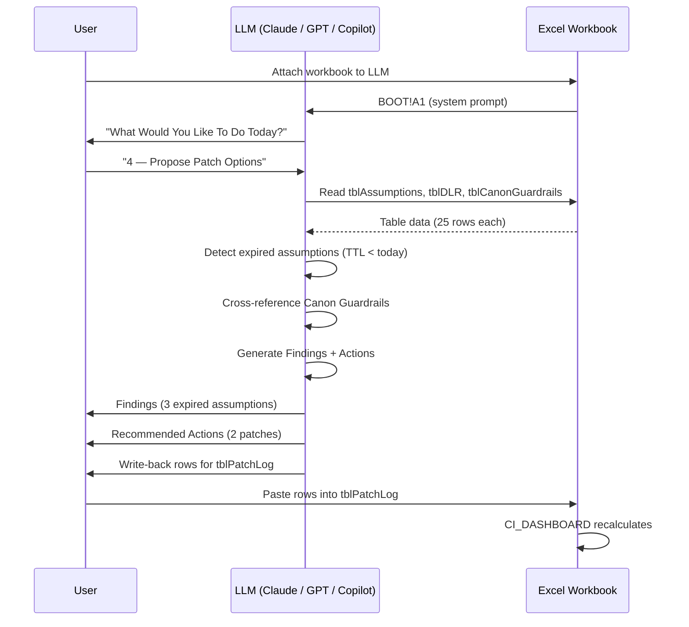

# Excel-First Governance

Architecture of the Creative Director Suite — how a shared Excel workbook becomes a governed decision surface via the BOOT protocol, named tables, and LLM-driven writeback.

## Writeback Flow

## Data Layer Summary

| Layer | Contents | Tables |
|-------|----------|--------|
| **Production** | 8 CSVs — creative production data (200 rows) | Clients, Campaigns, Projects, Assets, Shots, Tasks, Prompts, Approvals |
| **Governance** | 7 named tables — decision infrastructure (175 rows) | tblTimeline, tblDeliverables, tblDLR, tblClaims, tblAssumptions, tblPatchLog, tblCanonGuardrails |
| **Dashboard** | Coherence Index metrics | CI_DASHBOARD |

## Coherence Ops Mapping

| Excel Table | Primitive | Artifact |
|-------------|-----------|----------|
| tblTimeline, tblDeliverables | Decision Scaffold | DS |
| tblDLR | Decision Ledger Record | DLR |
| tblClaims | Atomic Claims | Claim |
| tblAssumptions | Reasoning Scaffold | RS |
| tblPatchLog | Patch Packets | Patch |
| tblCanonGuardrails | Canon | Canon |
