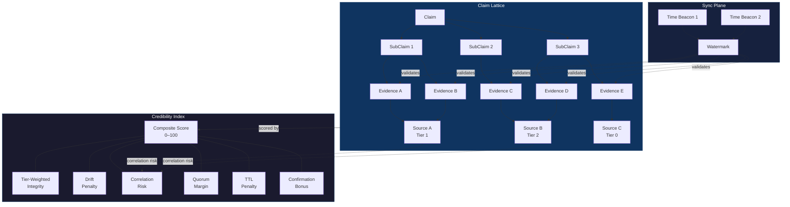

# 38 — Lattice Architecture

> Credibility Engine claim lattice: Claim → SubClaim → Evidence → Source, with Sync Plane timing infrastructure and Credibility Index scoring.

```mermaid
graph TD
    subgraph Lattice["Claim Lattice"]
        C1[Claim] --> SC1[SubClaim 1]
        C1 --> SC2[SubClaim 2]
        C1 --> SC3[SubClaim 3]
        SC1 --> E1[Evidence A]
        SC1 --> E2[Evidence B]
        SC2 --> E3[Evidence C]
        SC3 --> E4[Evidence D]
        SC3 --> E5[Evidence E]
        E1 --> S1[Source A<br/>Tier 1]
        E2 --> S1
        E3 --> S2[Source B<br/>Tier 2]
        E4 --> S2
        E5 --> S3[Source C<br/>Tier 0]
    end

    subgraph Sync["Sync Plane"]
        B1[Time Beacon 1] -.-> WM[Watermark]
        B2[Time Beacon 2] -.-> WM
        WM -.->|validates| E1
        WM -.->|validates| E2
        WM -.->|validates| E3
        WM -.->|validates| E4
        WM -.->|validates| E5
    end

    subgraph Index["Credibility Index"]
        CI[Composite Score<br/>0–100]
        CI --- TW[Tier-Weighted<br/>Integrity]
        CI --- DP[Drift<br/>Penalty]
        CI --- CR[Correlation<br/>Risk]
        CI --- QM[Quorum<br/>Margin]
        CI --- TTL[TTL<br/>Penalty]
        CI --- IC[Confirmation<br/>Bonus]
    end

    S1 -.->|correlation risk| CR
    S2 -.->|correlation risk| CR
    Lattice -->|scored by| CI

    style Lattice fill:#0f3460,stroke:#0f3460,color:#fff
    style Sync fill:#16213e,stroke:#0f3460,color:#fff
    style Index fill:#1a1a2e,stroke:#0f3460,color:#fff
```
